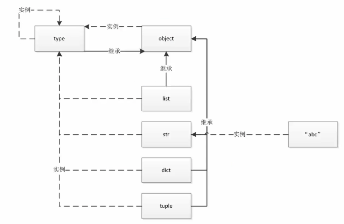
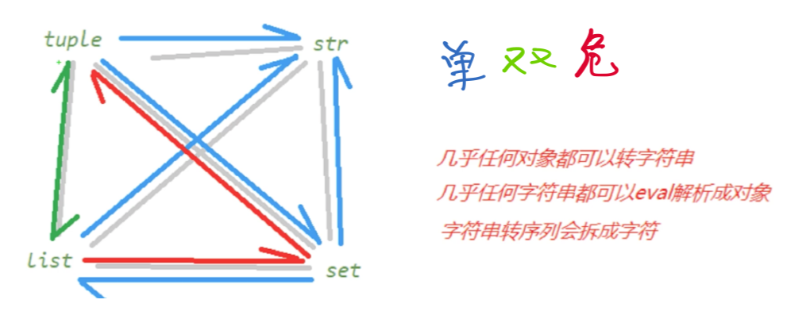
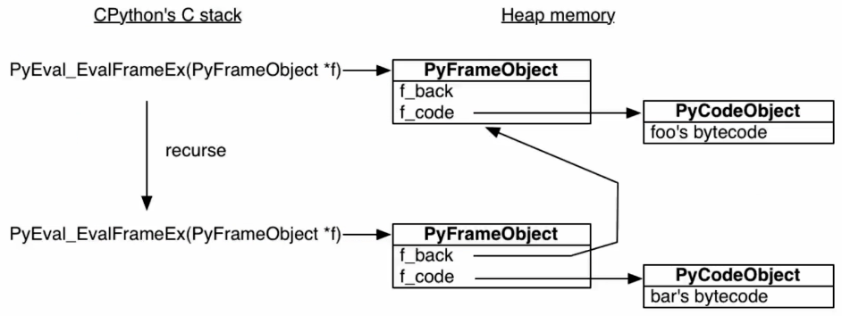
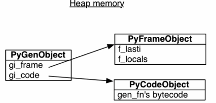
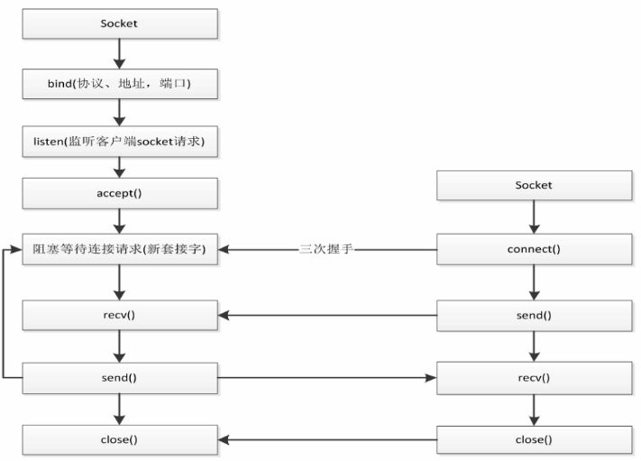
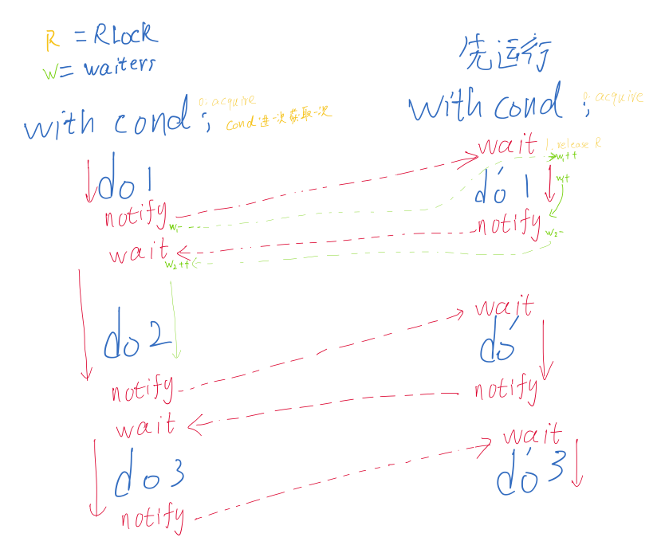
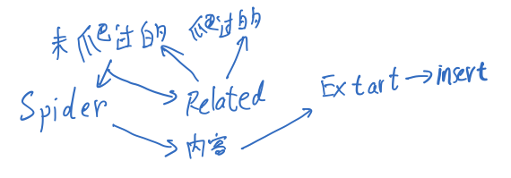
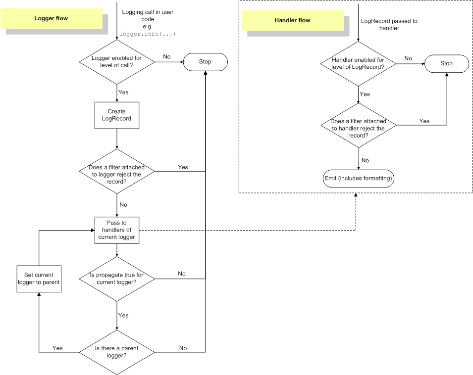

:::tip 📌Tip
python的进阶提高，波比很经典的课了，配合[cookbook](https://python3-cookbook.readthedocs.io/zh_CN/latest/index.html)和[文档](https://docs.python.org/zh-cn/3.9/)  
写的可能会很长
:::
<!-- more -->
[[toc]]
<div align="center"><h1><strong> python语言进阶</strong></h1></div>
动态语言只有在运行的时候才能发现错误，这是固有缺点  

## 初始化,模块,和包
### 资料源
- [cookbook](https://python3-cookbook.readthedocs.io/zh_CN/latest/index.html)
- [官方文档#第三方包](https://docs.python.org/zh-cn/3/library/index.html)
- [内置函数Built-in Functions](https://docs.python.org/3/library/functions.html)
- [第三方包查询pypi](https://pypi.org/)
- [Python Enhancement Proposals-PEP](https://peps.python.org/)

### python编码风格规范
[Python 风格指南 — Google 开源项目风格指南](https://zh-google-styleguide.readthedocs.io/en/latest/google-python-styleguide/contents/)  
[PEP 8 – Style Guide for Python Code](https://peps.python.org/pep-0008/)  
Python的创始人为Guido van Rossum。1989年圣诞节期间，在阿姆斯特丹，Guido为了打发圣诞节的无趣，决心开发一个新的脚本解释程序，作为ABC 语言的一种继承。之所以选中Python（大蟒蛇的意思）作为该编程语言的名字，是取自英国20世纪70年代首播的电视喜剧《蒙提.派森干的飞行马戏团》（Monty Python's Flying Circus）。  

:::tip 🎉Success
**python之禅**<br/>
写pythonic的代码

```
The Zen of Python, by Tim Peters

Beautiful is better than ugly.
Explicit is better than implicit.
Simple is better than complex.
Complex is better than complicated.
Flat is better than nested.
Sparse is better than dense.
Readability counts.
Special cases aren't special enough to break the rules.
Although practicality beats purity.
Errors should never pass silently.
Unless explicitly silenced.
In the face of ambiguity, refuse the temptation to guess.
There should be one-- and preferably only one --obvious way to do it.
Although that way may not be obvious at first unless you're Dutch.
Now is better than never.
Although never is often better than *right* now.
If the implementation is hard to explain, it's a bad idea.
If the implementation is easy to explain, it may be a good idea.
Namespaces are one honking great idea -- let's do more of those!

```

**翻译**

```
优美优于丑陋，
明了优于隐晦；
简单优于复杂，
复杂优于繁杂，
扁平优于嵌套，
稀疏优于稠密，
可读性很重要！
特例亦不可违背原则，
即使实用比纯粹更优。
错误绝不能悄悄忽略，
除非它明确需要如此。
面对不确定性，
拒绝妄加猜测。
任何问题应有一种，且最好只有一种，显而易见的解决方法。
尽管这方法一开始并非如此直观，除非你是荷兰人。
做优于不做，
然而不假思索还不如不做。
很难解释的，必然是坏方法。
很好解释的，可能是好方法。
命名空间是个绝妙的主意，我们应好好利用它。
```

:::

### 包和模块
- `if __name__ == "__main__":` 可以避免在被引入的时候直接被执行代码
- 基本信息
    - `# -*-coding:utf-8-*-` 指明文件的编码
    - `__author__ = "a_little_rubbish"`
    - `__date__ = "2022/5/19 18:06"`
- 包/模块的存放位置：`print(xx.__file__)`
- 查看包/模块里的内容：`print(dir(xx))`

正在运行的文件会被python添加到PATH中去  
- 模块(module)其实就是py文件，里面定义了一些函数、类、变量等
- 包(package)是多个模块的聚合体形成的文件夹，里面可以是多个py文件，也可以嵌套文件夹
- 库是参考其他编程语言的说法，是指完成一定功能的代码集合，在python中的形式就是模块和包
```python
import builtins  # 其实命名空间就是builtins
builtins.print("Hello world.")=print()
```
引入就要用import，import from，import as。  
导入其实是要将 被导入模块所有的顶格代码都执行一遍，遇到函数和类的定义会作申明。  
文件夹中新建一个`__init__.py`文件里面可以什么都不填，就被python当成包python3.3+可以省略但是不建议。  
正常import了啥东西才可以用啥，除非`import *` 但是import包之后可以直接调用在`__init__.py`文件文件中定义的变量，所以可以把想要导入后直接出现在命名空间的包内变量提前导入init使用`from . import 包中的模块`可保证移植性  
`import *`的方式无法导入以下划线开头的变量名，但可以指定变量导入  
`import *`只会导入`__all__=[variable，valriable]`中指定的变量，无论是否以下划线开头，这样限制可以防止`import *`命令导入太多变量污染命名空间  

PATH搜索顺序
- pycharm marked as source root告诉IDE[编译器](https://so.csdn.net/so/search?q=%E7%BC%96%E8%AF%91%E5%99%A8&spm=1001.2101.3001.7020)此文件夹及其子文件夹包含应作为构建过程的一部分进行编译的源代码。
    - 就可以从这下面找包了
-   首先搜寻内置模块是否有`hello`（所以我们定义的模块名不要和内置模块相同）
-   如果内置模块没有，则看PATH(即`sys.path`)里有没有
    - `''`表示当前的工作路径
    - 环境变量PYTHONPATH中指定的路径列表
        - 正在运行的文件会被python添加到PATH中去
    - 特定路径下的.pth文件中指定的路径列表 
        - Python 在遍历已知的库文件目录过程中，如果遇到 `.pth` 文件，便会将其中的路径加入到 `sys.path` 中
        - 一行一个，可空行可注释，相对路径是本.pth文件的位置为起始
    - 在python安装路径的lib库中搜索
- 绝对引用从包的位置开始
- 相对路径导入时
​ 自定义模块和非内置模块重名：按sys.path路径，优先级高的覆盖低的。
​ 自定义模块和内置模块重名：内置模块覆盖自定义模块。


**第一次导入时**：  
​ 1、在所导的模块下的命名空间中执行所有代码；
​ 2、创建一个module对象，并将模块内所有的顶级变量以属性的形式绑定到该对象上；
​ 3、在import语句所处的命名空间引入第2步创建的module对象的变量名称。  
**第二次导入时**：直接执行第3步。（1、2步创建的module对象放到`sys.modules`里了）  
**互相导入**:  不会像递归一样死循环，因为import的模块对象只创建一遍，不会再去执行第二遍。  


-   `from folder1.abcd import b`其实也执行了`__init__.py`文件文件与`abcd.py`文件
    - 实际上是import了两次，第二次检查`sys.modules`就忽略了
- 如果import这个文件夹下的子文件下的某个模块时，则先按顺序执行父文件夹的所有`__init__.py`，再执行该文件的`__init__.py`，再执行该模块  

`help(module)`查看模块的帮助手册  
在python的目录下有Doc文件夹有语言使用手册  
```python
try:
    import other_1 as o # 有1导1
except ModuleNotFoundError:
    import other_2 as o # 没1导2

```
<br/>
[^1]

#### 循环导入


此时`from test2 import c`报错 ，先引用test之后就不会了  
1.  引用`test2/c`模块
2.  由于是第一次引用`test2/c`模块，此时会执行`test2/c.py`文件，此时会执行`from test import a`
3.  此时执行了包`test/__init__.py`的代码，执行了`from . import b`，引用了模块`test/b`
4.  模块`test/b`由于是第一次被引用，会执行其中的代码，执行`from test2 import c`，循环引用出现，报错
5. 分析一下为什么先引入test就没关系了  

在引入没有完成的时候，又回来了就产生错误，如果已经引入完了，就没事和上面**互相导入**结合看  
### os
[先放文档](https://docs.python.org/3.9/library/os.html)  
os是和操作系统相关的包，里面有对文件夹和系统信息的调用，这里整理一点常用的  
和linux里面的命令一样的我就简单放一下  
`os.rename`,`os.mkdir[s]`,`os.rmove`,`os.chdir`，`os.chmod(_path_, 755）`,`os.getcwd()`,`os.chcwd()`,`os.chown(_path_, _uid_, _gid_)`,`os.listdir(path='.')`,`os.removedirs(_name_)`,`os.rmdir`
| 函数变量                    | 作用                                                                                                                                                                                                                                                                                                                                                                                                                                                                                                        |
|:--------------------------- |:----------------------------------------------------------------------------------------------------------------------------------------------------------------------------------------------------------------------------------------------------------------------------------------------------------------------------------------------------------------------------------------------------------------------------------------------------------------------------------------------------------- |
| `os.name`                     | 导入的依赖特定操作系统的模块的名称。以下名称目前已注册:`posix`,`nt`,`java`.                                                                                                                                                                                                                                                                                                                                                                                                                                 |
| `os.cpu_count()`              | 返回cpu内核数                                                                                                                                                                                                                                                                                                                                                                                                                                                                                               |
| `os.walk(top, topdown=True)`  | 遍历文件夹返回`dirpath, dirnames, filenames`                                                                                                                                                                                                                                                                                                                                                                                                                                                                |
| `os.curdir`                 | 操作系统用来表示当前目录的常量字符串                                                                                                                                                                                                                                                                                                                                                                                                                                                                        |
| `os.pardir`                 | 操作系统用来表示父目录的常量字符串                                                                                                                                                                                                                                                                                                                                                                                                                                                                          |
| `os.sep`                    | 操作系统用来分隔路径不同部分的字符。在 POSIX 上是 `'/'`，在 Windows 上是是 `'\\'`。<br/>注意，仅了解它不足以能解析或连接路径，请使用 [`os.path.split()`](https://docs.python.org/zh-cn/3.9/library/os.path.html#os.path.split "os.path.split") 和 [`os.path.join()`](https://docs.python.org/zh-cn/3.9/library/os.path.html#os.path.join "os.path.join")，<br/>但它有时是有用的。在 [`os.path`](https://docs.python.org/zh-cn/3.9/library/os.path.html#module-os.path "os.path: Operations on pathnames.") 中也可用。 |
| `os.altsep`                 | 操作系统用来分隔路径不同部分的替代字符。<br/>如果仅存在一个分隔符，则为 `None`。<br/>在 `sep` 是反斜杠的 Windows 系统上，该值被设为 `'/'`。在 [`os.path`](https://docs.python.org/zh-cn/3.9/library/os.path.html#module-os.path "os.path: Operations on pathnames.") 中也可用。                                                                                                                                                                                                                                       |
| `os.extsep`                 | 分隔基本文件名与扩展名的字符，<br/>如 `os.py` 中的 `'.'`。在 [`os.path`](https://docs.python.org/zh-cn/3.9/library/os.path.html#module-os.path "os.path: Operations on pathnames.") 中也可用。                                                                                                                                                                                                                                                                                                                   |
| `os.pathsep`                | 操作系统通常用于分隔搜索路径<br/>（如 `PATH`）中不同部分的字符，<br/>如 POSIX 上是 `':'`，Windows 上是 `';'`。在 [`os.path`](https://docs.python.org/zh-cn/3.9/library/os.path.html#module-os.path "os.path: Operations on pathnames.") 中也可用。                                                                                                                                                                                                                                                                    |
| `os.linesep`                | 当前平台用于分隔（或终止）行的字符串。<br/>它可以是单个字符，如 POSIX 上是 `'\n'`，也可以是多个字符，如 Windows 上是 `'\r\n'`。<br/>在写入以文本模式（默认模式）打开的文件时，请不要使用 _os.linesep_ 作为行终止符，<br/>请在所有平台上都使用一个 `'\n'` 代替。                                                                                                                                                                                                                                                            |
| `os.devnull`                | 空设备的文件路径。<br/>如 POSIX 上为 `'/dev/null'`，Windows 上为 `'nul'`。在 `os.path`中也可用。                                                                                                                                                                                                                                                                                                                                                                                                                 |

#### os.path
[os.path](https://docs.python.org/zh-cn/3/library/os.path.html)模块是和路径相关的模块

|           函数和变量            |                                                                                                                                    功能                                                                                                                                    |
|:-------------------------------:|:--------:|
|     `os.path.abspath(PATH)`     |获取绝对路径 |
|       `os.path.split(f)`        |分割路径文件名  |
|      `os.path.splitext(f)`      |分割文件后缀名 |
|`os.path.dirname`|返回路径名|
|   `os.path.basename(_path_)`    |获得文件/最后路径名<br/>此函数的结果与Unix **basename** 程序不同。<br/>**UNIX basename** <br/>在 `'/foo/bar/'` 上返回 `'bar'`，而<br/> [`os.path.basename()`](https://docs.python.org/zh-cn/3/library/os.path.html#os.path.basename "os.path.basename") 函数返回一个空字符串 (`''`) |
| `os.path.commonpath(_paths_)` |接受包含多个路径的序列 _paths_，返回 _paths_ 的最长公共子路径。  |
| `os.path.commonprefix(_list_)`     |  接受包含多个路径的 _列表_，返回所有路径的最长公共前缀（逐字符比较）|
|`os.path.join(_path_, _*paths_)`|智能地拼接一个或多个路径部分。 返回值是 _path_ 和 _*paths_ 的所有成员的拼接|
|isdir,isfile,isabs,islink,exists,ismount|判断是啥|
#### 内置的变量
- `vars()` 以字典方式返回内置全局变量
- `__doc__` 获取文件开头的注释
- `__file__`完整的文件和路径名
- `__package__`获取导入文件的路径，多层目录以点分割，注意：对当前文件返回None
- `__cached__` 获取导入文件的缓存路径
- `__name__` 获取导入文件的路径加文件名称，路径以点分割，注意:获取当前文件返回__main__

### sys
[文档](https://docs.python.org/zh-cn/3/library/sys.html)，这里面是和解释器运行相关的东西  
|             函数和变量             |                                                                        功能                                                                        |
|:----------------------------------:|:--------------------------------------------------------------------------------------------------------------------------------------------------:|
|   `sys.getfilesystemencoding()`    |                                                                  获取文件系统编码                                                                  |
|     `sys.getdefaultencoding()`     |                                                    当前 Unicode 实现所使用的默认字符串编码名称                                                     |
|          `sys.copyright`           |                                                                打印python的版权信息                                                                |
|             `sys.argv`             |                                                     返回运行的参数列表，`sys.argv[0]`是脚本名                                                      |
|           `sys.version`            |                                                                    获取py版本号                                                                    |
|           `sys.maxsize`            |                                                              本系统能表示的int最大值                                                               |
|             `sys.path`             |                                                                    获取系统路径                                                                    |
|           `sys.platform`           |                                                                  获取python的平台                                                                  |
|           `sys.exit(0)`            |                                                                   退出(程序代码)                                                                   |
|          `sys.executable`          |                                                              当前python解释器绝对路径                                                              |
|     `sys.getrecursionlimit()`      |                                                         可以递归的最大层数，可以在递归里用                                                         |
|     `sys.setrecursionlimit()`      |                                                                    设定最大层数                                                                    |
|     `sys.getrefcount(object)`      |                           返回 object 的引用计数。通常比预期的多一，<br/>因为包括了getrefcount()参数的这一次（临时）引用                           |
|           `sys.modules`            |                                                              返回已经被引入的模块列表                                                              |
| `sys.getsizeof(object[, default])` | 返回对象的大小（以字节为单位）,<br/>只计算直接分配给对象的内存消耗，<br/>不计算它所引用的对象的内存消耗,<br/>对象不提供计算大小的方法时指定default |
| `sys.stdin`                                   |             获取标准输入流，list转化一下打印出来看看是什么(一般的项目不会用到)                                                                                                                                       |


------------
## 深入OOP
多深才能叫深入呢？  
保持谦抑  
### python中的一切皆对象
python比java的一切皆对象更加彻底，所以更加灵活，其灵活性就是靠这实现的  
java中Object是class的一个实例，但是在py中**类class**也是对象，**函数**，代码和模块也是对象。都可以被动态的赋值，所以才会有python的迷惑操作[我写我自己](https://www.bilibili.com/video/BV1pU4y1m7kf)  
一切都是"一等公民"意味着可以  

1. 赋值给一个变量
2. 可以添加到集合对象中 
3. 可以作为参数传递给函数
4. 可以当做函数的返回值（闭包原理）

按照内存模型理解所有的**变量**都是彻底的“引用”，指向实际的内存，变量可以被任意引用  
所以python不用实现多态，鸭子就已经很多态了。python支持多继承，封装的注意在基础部分有  
### 类的源头
梳理一下关系  
type是可以创建类的  
type类生成了class，class生成了对象，`type->class->otherObject`  
内置类型基本都是class类型，type套娃两次返回的就是type类  
`type(type(int)) : <class 'type'>`  

`object`是所有类都要继承的顶层基类，`class Class()`后面括号不写东西默认继承顶层基类 ps现在加不加都一样但是有些人的代码会有所区分，因为py2中是不一样  



:::tip 📝Note
**type和object的关系**<br/>`type`本身既是类又是对象，`type`继承自`object`  
`object.__base__`返回是()空,而`type(object)`是`type`类型 
  
上图中很奇怪的点，也就是python中有两个神同时纠缠出现  
  
`type`的父类是`type`实例化的，然而`type`继承了父类，时间在此时消失了。
从C的角度理解，一开始申请了俩内存块，再开始解释python  
  
`type`此时可以开始构建万物，所有的类，对象，都是他派生的，自己(类)实例化生成自己(类)  
从C的角度理解，`type`的指针指向一个内存块，内存块自行复制一次就可以。

:::

### 类属性和实例属性
#### 变量权限命名规范
`_`可以访问但不建议  
`__`私有变量（private）不能直接访问`__name`是因为Python解释器对外把`__name`变量改成了`ClassName._ClassName__name`  
`__xxx__`是特殊变量。  

#### 变量查找顺序

^5e3db7

大致是<span style="background:greenyellow">由下而上查找</span>
优先查找 **对象** 变量，找不到就向上查找 **类** 变量。  
修改 **对象** 的 **类变量** 时不会更改 **类** 的 **类变量** ，只是给对象自己添加了一个 **对象变量** 覆盖了 **类变量** ，所以其他对象和类的 **类变量** 不变  
  
修改 **类变量** 的时候，所有的 **对象** 的 **变量** 都变，因为类变量是共享的  
子类修改了类变量时只有子类链条下生效  


#### 多继承下搜索
在单继承这样就够了，但是多继承就寄了。  
py的**方法解析顺序**（Method Resolution Order，**MRO**）使用的是C3算法，python2.3前使用的是DFS或BFS，但是这样无法解决菱形继承  
C3算法实现了三种重要特性：
-   保持继承[拓扑图](https://link.zhihu.com/?target=https%3A//zh.wikipedia.org/w/index.php%3Ftitle%3D%25E6%258B%2593%25E6%2589%2591%25E5%259B%25BE%26action%3Dedit%26redlink%3D1)的一致性。
-   保证局部优先原则（比如A-->C-->B，那么A读取父类方法，应该优先使用C的方法而不是B的方法）。
-   保证单调性原则（即子类不改变父类的方法搜索顺序）。

类的`__mro__`属性或`mro()`方法可以直接查看搜索顺序，C3会按照多继承的参数顺序进行搜索。三角继承会直接报错无法进行mro


### 构造析构
#### 实例方法
一般的方法都是实例方法，只针对实例进行操作，会传入self，`cls.func()`调用的时候，python会自动转成`func(cls)`  
#### 静态方法
对象构造前处理输入，对象还没有构造出来，每次都要处理不是很规范  
使用装饰器`@staticmethod`  
在类中定义方法，不需要传入self，可以通过类直接调用，好处是将命名空间和处理拿到了类里面去，可以直接返回对象。  
坏处就是类名是硬编码，修改类名的时候需要去修改，如果只是处理和判断是否规范，不需要返回对象，就可以用静态方法  
所以在这种动态的构造需求下，就需要用类方法`@classmethod`  
第一个参数为cls，代表类本身。  
:::details Click to see more

```python
class Dates:  # 假设要拿到时间  
    def __init__(self, yy, mm, dd):  
        self.yy = yy  
        self.mm = mm  
        self.dd = dd  
  
    def __str__(self):  
        return "{yy}年,{mm}月,{dd}日".format(yy=self.yy, mm=self.mm, dd=self.dd)  
  
    @staticmethod  # 静态方法装饰器  
    def test_string(string):  # 不用传入self等  
        # l = string.split("-")  
        # return Dates(l[0], l[1], l[2]) # 硬编码创建  
        try:  
            l = string.split("-")  
            for i in l:  
                int(i)  
            return True  
        except Exception as e:  
            return False  
  
    @classmethod  # 类方法装饰器  
    def create_from_string(cls, string):  # 第一个参数为cls  
        l = string.split("-")  
        return cls(l[0], l[1], l[2])  # 动态创建  
  
  
d1 = Dates(21, 2, 3)  
print(d1)  
check = Dates.test_string("21-2-3")  
d2 = Dates.create_from_string("21-2-4")  
print(d2, check)  
  
print("------------")  
  
  
class MordenDate(Dates): # 是可以继承的  
  
    morden = 1  
  
    @staticmethod  # 静态方法装饰器  
    def test_string(string):  # 继承之后  
        print("I am a ModernDate")  
        try:  
            l = string.split("-")  
            for i in l:  
                int(i)  
            return True  
        except Exception as e:  
            return False  
  
md1 = MordenDate(22, 5, 3)  
print(md1)  
mcheck = MordenDate.test_string("22-5-8")  
md2 = MordenDate.create_from_string("22-5-8")  
excheck=isinstance(md2,MordenDate) # 继承后是否动态创建  
print(md2,excheck, mcheck)
```
运行结果
```
21年,2月,3日
21年,2月,4日 True
------------
22年,5月,3日
I am a ModernDate
22年,5月,8日 True True
```
:::

#### `__new__`和`__init__`
 ^e46b78
  
`__new__`的第一个参数是类本身，而`__init__`第一个参数传入的是对象本身，new是管对象生成前的动作，init是完善对象本身  
new会通过可变参数提前获取到初始化传入的属性，必须return`super().__new__(cls)`回去，不然没法调用init继续创建  
```python
class A():  
    def __new__(cls, *args, **kwargs):  # 第一个参数指向的是类本身  
        print("new...")  
        return super().__new__(cls) # 注意返回什么  
    def __init__(self,name):  
        print("Initializing...")  
        self.name=name  
a=A(name="hhh")

#----结果----
new...
Initializing...
```
主要是在元类编程中用的多

#### 析构函数
- del本质上调用的是`__del__`删除的
    - 可以重载比如删除时释放资源

#### 定制属性
定制属性使用slots ^144b67

类在动态添加属性的时候，给class绑定方法后，所有实例均可调用，我们不想让他乱添加，可以用`__slots__`指定，翻译过来是插槽很好理解  
```python
class Student:  
    __slots__ = ('name', 'age')  
s=Student()  
s.name="aba"  
print(s.name)  
s.value="ss"
#----结果----
aba
Traceback (most recent call last):
  File "slots.py", line 7, in <module>
    s.value="ss"
AttributeError: 'Student' object has no attribute 'value'
```

### 自省(反射)机制
反射的概念是由Smith在1982年首次提出的，主要是指程序可以访问、检测和修改它本身状态或行为的一种能力。
[变量查找顺序](#^5e3db7)  
使用`obj.__dict__`查看<span style="background:greenyellow">对象</span>所有的属性,此时发现类和父类中的属性都没有出现，因为他是之查看这个对象的。  
查看 **类对象** 的属性，同时可以当字典取出属性  
之所以能调用就是MRO做的  
使用`__dict__`可以查看甚至修改已有的属性添加新的，<span style="background:greenyellow">只有对象实例才能添加</span>，给类添加被解释器阻止了  
使用`dir(obj)`可以列出所有属性，包括类系统内建的，但是没有值只有名称  
一些内置类型没有`__dict__`但是都可以使用`dir()`(会寻找包括从父类中继承的属性)

:::details Click to see more

```python
# 私有变量  
class A():  
    a=1  
    pass  
class B(A):  
    """ # 注意'__doc__' 属性
    doc    
    """    
    b=2  
    def __init__(self,x):  
        self.x=x  
b=B(5)  
print(b.__dict__,"\n",B.__dict__,"\n")  
b.__dict__["add"]="add success"  # 对象添加属性
print(b.__dict__,"\n",dir(B),)
```
运行结果
```
{'x': 5} 
 {'__module__': '__main__', '__doc__': '\n    doc\n    ', 'b': 2, '__init__': <function B.__init__ at 0x10e5e0820>}  

{'x': 5, 'add': 'add success'} 
 ['__class__', '__delattr__', '__dict__', '__dir__', '__doc__', '__eq__', '__format__', '__ge__', '__getattribute__', '__gt__', '__hash__', '__init__', '__init_subclass__', '__le__', '__lt__', '__module__', '__ne__', '__new__', '__reduce__', '__reduce_ex__', '__repr__', '__setattr__', '__sizeof__', '__str__', '__subclasshook__', '__weakref__', 'a', 'b'] 
```
:::
#### super()的用法
在继承中，如果重定义某方法，该方法会覆盖父类的同名方法，但有时我们希望能同时实现父类的功能，这时，我们就需要调用父类的方法了。  
调用父类同名方法有两种方式：  
1. 调用未绑定的父类方法
    - 多继承时会导致多次调用方法
2. 使用super函数来调用
    - 最常见的就是使用`super().__init__()`
Python 3 可以使用直接使用 `super().xxx`代替 `super(Class, self).xxx`  
`super()`不是直接调用父类，而是按照MRO顺序进行构造  

### Mixin混合模式
- 混合优于继承
- Mixin功能单一
    - Mixin只实现了某些单一的功能，可以利用继承来组合这些功能
    - 联想魔法函数基于协议的编程，oop中就使用mixin
- 不和基类关联，可以任意组合
- 在Mixin中不要使用super
- 混入类不能直接被实例化使用。
- 混入类没有自己的状态信息，也就是说它们并没有定义 `__init__()` 方法，并且没有实例属性。
  
主要是掌握编程思想，cookbook里有[这一章](https://python3-cookbook.readthedocs.io/zh_CN/latest/c08/p18_extending_classes_with_mixins.html)的示例。
  
### 抽象基类(掌握思想)
abc抽象基类(abstract base class)是无法实例化的，继承抽象基类必须要实现基类规定的某些方法  
所有的抽象基类的metaclass参数都必须是`metaclass=ABCMeta`  
两种情况下需要抽象基类  
- 一是判定能不能使用某些方法，比如是否实现了len 
- 二是规定子类必须实现某些方法。  
这样在实现某些功能的替代和扩展的时候，就无需修改原来的代码，直接继承并且实现预留的接口就可以了  
引入内置包`abc`  
:::details Click to see more

```python
# 假设我们继承Cache实现RedisCache  
import abc
class Cache(object, metaclass=abc.ABCMeta):  
  
    @abc.abstractmethod  
    def get(self):  
        pass  
  
    @abc.abstractmethod  
    def set(self):  
        pass  
  
  
class RedisCache(Cache):  
    pass  
  
rdc = RedisCache() # 实例化的时候没有实现这俩方法就报错
```
运行结果
```
Traceback (most recent call last):
  File "/Users/jack/code/py/AdvancedPython/main.py", line 69, in <module>
    rdc = RedisCache()
TypeError: Can't instantiate abstract class RedisCache with abstract methods get, set
```
:::

在判断类型的时候，比如判断`isinstance(obj,Sized)` 实际上是判断了obj是否实现`__len__` 使用的是`__subclasshook__(cls, C)`  
摘一下`collection/abc.py Sized`源码

:::details Click to see more

```python
# collections/abc.py中的源码

class Sized(metaclass=ABCMeta):

    __slots__ = ()

    @abstractmethod
    def __len__(self):
        return 0

    @classmethod
    def __subclasshook__(cls, C): # 注意这个方法
        if cls is Sized:
            return _check_methods(C, "__len__")
        return NotImplemented


# 示例代码
from collections.abc import Sized  
  
isinstance(c, Sized) # c的类实现了__len__ 所以返回为True

```
运行结果
```
True
```
:::

抽象基类使用了元类来进类型检查，collections.abc里面都使用了metaclass  
实际上内置的常用类型也不是使用抽象基类实现的，Cpython实现的更加精妙  
:::tip 📌Tip
更推荐使用Mixin和鸭子类型实现功能，**组合优于继承**  
不实现就抛出错误实现类似接口的功能，更加灵活
:::


## 魔法函数
在类中`__func__()`类似的函数就是魔法函数，一般不需要自定义，系统提前定义好自己重载即可，可以用来定制特性.
***魔法函数不是object的方法***,不是继承来的  
python的语法和内置函数会识别自定义对象里面的魔法函数，隐式调用，通过魔法函数定义，可以使对象具有某些特性，"成为"某些类型，实际上不是这些类型，是鸭子类型的功能，区别于java中需要继承特定的类或者接口   
  
这种做法叫做<span style="background:greenyellow">协议</span>，尽量遵守协议编程
### 实现适应len和for
`__len__(self)`会被内置函数`len()`调用，要求返回一个整数  
实际上len内置数据结构的时候list set这种，直接读取cpython维护在内存中记录，很快就返回，不会傻乎乎去数长度。所以尽量使用内部定义的东西。

`__getitem__(self,item)`,使用for的时候，解释器先找`__iter__()`找不到就会寻找这个函数，从1开始取直到`StopIteration`  
实际上通过这个函数成为了序列类型，就可切片了。  

:::details Click to see more

```python
class Company(object):  
    def __init__(self, employee_list):  
        self.employee = employee_list  
  
    def __getitem__(self, item):  
        # 这里可以放一些检查代码，随你了  
        return self.employee[item]  
  
    def __len__(self):  
        return 10  
  
  
c = Company(["1", "2", "3"])  
for i in c:  
    print(i)  
print("长度是",len(c))
```
运行结果
```
1
2
3
长度是 10
```
:::

### 控制打印对象的输出
`__repr__()`在开发模式比如jupyter直接调用显示的  
`__str__()`print它显示啥  
:::details Click to see more

```python
class Demo2(object):  
    def __str__(self):  
        return "我是🦈"  
  
    def __repr__(self):  
        return "你猜我是😦个"  
  
  
d = Demo2()  
print(d)  
d
```
运行结果
```
我是🦈
你猜我是😦个
```
:::

### 数学运算
不是重点，需要啥现查自己试试。  
`__ads__()`，由abs()调用  
`__add__()`,+调用  

:::details Click to see more

```python
class Vector(object):  # 坐标相加  
    def __init__(self, x, y):  
        self.x = x  
        self.y = y  
  
    def __str__(self):  
        return "{0},{1}".format(self.x, self.y)  
  
    def __add__(self, other):  
        return Vector(self.x + other.x, self.y + other.y)  
  
    def __abs__(self):  
        return Vector(abs(self.x), abs(self.y))  
  
  
v1 = Vector(1, 2)  
v2 = Vector(-3, -4)  
v2 = abs(v2)  
v1 = v1 + v2  
print(v1,v2)
```
运行结果
```
4,6 3,4
```
:::
### 实现with语句和简化
#### try-finally语句
正常的finally是用作资源释放的，比如写文件数据库发生错误，在finally中close释放资源。  
在函数中try-finally多个return的时候，注意顺序

:::details Click to see more

```python
def fun():  
    try:  
        print("rise")   
        raise KeyError  # 1 出错了
        return 1   # 不执行
    except KeyError as e:  
        print("catch")  # 捕获执行
        return 2  # 压栈
    else:  
        print("other Error")  
        return 3  
    finally:  
        print("finally")  # 必执行
        return 4  # 压栈
print(fun()) # 从栈顶取一个，所以最后fun返回是4，如果finally没返回语句，那么栈顶是2，返回的就是2
```
运行结果
```
rise
catch
finally
4 # 返回值
```
:::

#### 实现with
上下文管理器就是简化了try-finally整出来的  
实现了上下文管理，类似于with-open  
实现`__enter__(self)`最后要返回self  
同时实现`__exit__(self, exc_type, exc_val, exc_tb)` 可以不返回

:::details Click to see more

```python
class ContextManager:  
  
    def __enter__(self):  
        print("开始")  
        return self  
  
    def __exit__(self, exc_type, exc_val, exc_tb):  
        print("退出")  
  
    def func(self):  
        print("功能代码")  

with ContextManager() as cm:  
    cm.func()
```
运行结果
```
开始
功能代码
退出
```
:::

#### contextlib简化with
python内置了装饰器  `@contextlib.contextmanager`可以直接简化这东西  
被装饰函数中需要含有一个`yield`，`yield`之前的是`__enter__`的处理，之后是`__exit__`的处理  
使用了yeild生成器，后面会写到，这里就有样学样yield空字典就行  
:::details Click to see more

```python
from contextlib import contextmanager  
  
@contextmanager  
def ContextManager():  
    print("开始")  
    yield {}  
    print("退出")  
  
with ContextManager() as cm:  
    print("功能代码")
```
运行结果
```
开始
功能代码
退出
```
:::

### 属性操作三剑客
`__ getattribute__`方法、`__setattr__方法、` `__delattr__方法`  
[元类编程->](#^25cbec)
- `setattr(obj, k, v)`: obj.k=v
- `getattr(obj, k)`: obj.k
- `hasattr(obj,k)`:返回bool，就是看看有没有，也可以看字典的，使用过捕获getattr错误实现的
### 构造析构
`__new__`和`__init__`  
在thread里面已经写了init方法，直接`super().__init__(para)`就可以构建了  
[深入OOP->构造析构->](#^e46b78)
### 定制类属性
`__slots__`  
[深入OOP->构造析构->](#^144b67)
### 迭代器和生成器
[迭代器和生成器->](#^a159bd)
### 零散的功能
- 实现了`__contains__`可以in判断,找不到就找`__getitem__`，所以实现了这也可以
- 反转实现的是`__reversed__`
- 类属性`cls.__base__`查看一个类的父类
- 使用`obj.__dict__`查看对象所有的属性
- 使用`cls.__init__.__default__`查看默认参数
- `BOOL: hasattr(class,"funcName")`判断是否有这个属性
- `getattr(obj,k)`等价于`obj.k`
- 函数和类的`__name__`属性，可以拿到名字
- `__class__`获取类型
- 只要定义类型的时候，实现`__call__`函数，这个类型就成为可调用的。换句话说相当于重载了括号运算符。
- 函数注解的信息，保存在 `__annotations__` 属性中可以来调用。

:::tip 📄Info
其实魔法函数和类内置属性很多，这里整理一下他讲到的和我自己实验到的  
剩下的去看文档搜吧
:::

```python
# 根据第一个列表过滤第二个列表
filter_data = [x for x in list2 if
              all(y  not in x for y in list1)]
```

## 元类编程
控制类实例化的过程
### 计算属性@property
使用`@property`装饰器将函数包装成动态变量，更容易调用
:::details Click to see more

```python
from datetime import date, datetime  
  
  
class User():  
    def __init__(self, name, birth):  
        self.name = name  
        self.birth = birth  
        self._age = 0  
  
    def old_get_age(self):  # 老式代码需要调用函数比较麻烦  
        return datetime.now().year - self.birth.year  
  
    @property  
    def age(self):  # 装饰之后函数名就是属性名直接调用  
        return self._age  
  
    @age.setter  # set方法  
    def age(self, value):  
        self._age = value  
  
  
user1 = User("a", date(year=1988, month=5, day=25))  
  
user1.age = 2  # 直接设置  
print(user1.old_get_age(), user1.age)
```
运行结果
```
34 2
```
:::
### 属性操作三剑客
`__getattr__` 尝试获取不存在的属性的时候，如果定义了此方法，就不会报错会运行这个方法,这个若是运行了那下面那个必备运行  
`__getattribute__` 这个只要找就会进入，一般不建议重载，很容易崩，只要重写必然会无限递归，为了避免无限递归，应该把获取属性的方法指向一个更高的超类，例如`object`  
`return super().__getattribute__(item)`

Python中属性操作捕获的三剑客：`__getattribute__`方法、`__setattr__`方法 `__delattr__`方法 ^25cbec

:::details Click to see more

```python
class User1():  
    def __init__(self, name):  
        self.name = name  
  
    def __getattr__(self, item): # 找不到才进来  
        print(type(item))  
        return "get {0} error".format(item)  
  
    def __getattribute__(self, item): # 只要找就进来  这里有BUG
        print("seeking attr")  
        return item  
  
  
user1 = User1("a")  
print(user1.name)
```
运行结果
```
seeking attr
<class 'str'>
a get age error
```
:::

### 属性描述符descriptor
这里有一篇[别人的](https://www.waynerv.com/posts/python-descriptor-in-detail/)  
当我们的类有很多属性，都需要写检查方法的时候，一个属性一套检查方法代码重复度很高，此时可以定义一个类专门进行属性检查处理等，实现`__get__` `__set__` `__delete__`中的任意一个，这个类就成了属性描述符  
和django里面module的逻辑是一致的，但是django写的更加动态和灵活，也是大部分ORM的实现原理  

:::details Click to see more

```python
import numbers  
class IntField():  
    def __get__(self, instance, owner):  
        print("getting。。。")  
        return self.value # 获取的时候就返回存储的值  
  
    def __set__(self, instance, value):  
        print("setting。。。")
        if not isinstance(value,numbers.Integral):  
            raise ValueError("int is needed")  
        #注意检查完了不要赋给instance,  
        #因为instance就是User对象，又回来了会死循环  
        self.value=value  
  
    def __delete__(self, instance):  
        print("delete。。。")  
        pass  
  
class User():  
    age=IntField()  
  
user=User()  
user.age=4  
print(user.age)  
del(user.age)
```
运行结果
```
setting。。。
getting。。。
4
delete。。。
```
:::

根据所实现的协议方法不同，描述符又可分为两类：  
  
-   若实现了 `__set__()` 或 `__delete__()` 任一方法，该描述符是一个数据描述符（`data descriptor`）。
-   若仅实现 `__get__()` 方法，该描述符是一个非数据描述符（`non-data descriptor`）。
  
两者的在表现行为上存在差异：  
  
-   数据描述符总是会覆盖实例字典 `__dict__` 中的属性。
    - 定义实例 `__dict__[attr]`之后调用 `__dict__[attr]`或`obj.attr`还是会使用描述符
    - 使用了数据描述符会被存储在类的数据描述符中，不进入实例的 `__dict__` 属性列表
-   而非数据描述可能会被实例字典 `__dict__` 中定义的属性所覆盖。
    - 优先级不如类高，注意下面说明顺序
:::tip 📄Info
**描述符查找过程**<br/>
```python
user.age等价于getattr(user,’age’)

而对于描述符__get__的调用是发生在__getattribute__内部的。
调用顺序
调用__getattribute__
if 类定义了__getattr__方法 && 调用抛出 AttributeError :
    调用__getattr__

user = User(), 那么user.age 顺序如下：

if “age”是出现在User或其基类的__dict__中 && age是data descriptor : 
    调用其__get__方法
    
elif “age”出现在user对象的__dict__中 :
    直接返回 obj.__dict__[‘age’]

elif “age”出现在User或其基类的__dict__中 : 
    if “age”是non-data descriptor : 
        那么调用其__get__方法
    else :返回 __dict__[‘age’]

elif User有__getattr__方法 : 
    调用__getattr__方法
    
else : 抛出AttributeError

```
:::

### 元类metaclass

把class定义语句放在函数内，根据传入的字符串不同返回不同的类引用，然后创建对应的实例，这种动态创建实例的机制在java这种静态语言中很难实现。  
但是python做的不止于此，还能继续动态  
  
`type(name ,base,dict)`类名，基类没有就空tuple，属性没有就空字典  
这种创建类的类就是元类，`type`是一种元类，继承type之后就可以创建一个特殊的类(其他都继承自object): 元类，利用创建类时的**metaclass**参数就可以控制类的生成过程，可以注入很多东西   
:::details Click to see more
**type生成**<br/>
```python
class BaseClass:  
    def echo(self):  
        print("I am BaseClass")  
  
def boundFun(self,string): # 注意绑定的时候第一个参数默认传入对象  
    print(self.att)  
    print(string)  
#使用type创建了一个类  
T=type("T",(BaseClass,),{"bound":boundFun,"att":"dynamic att"})  
  
t=T()  
t.echo()  
t.bound("para fun")
```
运行结果
```
I am BaseClass
dynamic att
para fun
```
:::
类的生成过程  
metaclass可以隐式地继承到子类，但子类自己却感觉不到  
创建类时会首先寻找metaclass，，通过metaclass创建，类找不到就去父类找，先找到那个就使用哪个metaclass，都找不到就会去用type创建  
抽象基类使用了元类来进类型检查，collections.abc里面都使用了metaclass  
:::details Click to see more

```python
class MetaClass(type):  
    def __new__(cls, *args, **kwargs):  
        print("new...")  
        print('this is args : ',args) #打印一下  
        print('this is kwargs : ',kwargs)  
        kwargs={} # 把他置为{}因为原先就是空，如果不置空x传进去报错  
        return super().__new__(cls,*args, **kwargs)  
  
class M(metaclass=MetaClass,x=5): # 传入了额外的x=5  
    def __init__(self,name):  
        self.name=name  
  
m=M(name="ha")  
print(m.name)
```
运行结果
```
new...
this is args :  ('M', (), {'__module__': '__main__', '__qualname__': 'M', '__init__': <function M.__init__ at 0x10a7f7280>})
this is kwargs :  {'x': 5}
ha
```
:::
new的参数arg`def __new__(cls,  name类名, bases父类, attrs属性们, **kwargs):`  
### example-1元类实现ORM
利用元类自己写个ORM  
就不连SQL了，打印一下就好  
要求  
1. 使用数据描述符来定义字段  
2. 字段要指明  
    - 字段最大长度(检查)  
    - 插入数据库的字段，不指明就默认变量名  
    - 类型，最大最小值(检查)  
3. 使用内部类指明表，注释等其他信息  
4. save即获取格式化的所有表，字段的信息，并打印

:::details Click to see more
**元类实现ORM**<br/>
```python
import numbers  

def check_args(value, types):  # 检查参数的类型  
    if isinstance(value, types):  
        return value  
    else:  
        raise TypeError("need a %s Type" % types.__name__)  
  
class Field:  # 使用这个来判断类型是否正确  
    pass  
  
class IntegerField(Field):  
  
    def __init__(self, min, max):  
        self.min = check_args(min, numbers.Integral)  
        self.max = check_args(max, numbers.Integral)  
  
    def __get__(self, instance, owner):  
        return self.value  
  
    def __set__(self, instance, value):  
        value = check_args(value, numbers.Integral)  
        if self.min <= value <= self.max:  
            self.value = value  
        else:  
            raise ValueError("number is illagel")  
  
    def __delete__(self, instance):  
        print("delete attribute")  
        pass  
  
class StringField(Field):  
  
    def __init__(self, max_size=100):  
        self.max_size = check_args(max_size, numbers.Integral)  
  
    def __get__(self, instance, owner):  # instance 传的是module  
        return self.value  
  
    def __set__(self, instance, value):  
  
        value = check_args(value, str)  # 类型检查  
        if len(value) >= self.max_size:  
            raise ValueError("value too large")  
        else:  
            self.value = value  
  
    def __delete__(self, instance):  
        print("delete attribute")  
        pass  
  
class ModuleMetaClass(type):  
    def __new__(cls, name, bases, attrs, **kwargs):  
    #元类中可以获得属性，放到attr中带到基类中
        if name == 'BaseModule':  # 如果是Module基类原路返回  
            return super().__new__(cls, name, bases, attrs, **kwargs)  
        fields = {}  # 表的字段信息  
        # print(name, bases, attrs)  # 看一看属性都藏在哪
        for k, v in attrs.items():  # 找  
            # print(k)  
            if isinstance(v, Field):  # 如果是Field类型就添加进这个表属性里面  
                fields[k] = v  
        # print(fields)  
        table = {}  # 表的信息  
        meta = attrs.get("Meta", None)  # 是否定义了meta  
        if meta is not None:  
            attrs["table_name"] = meta.table_name  # 定义了meta就用meta的表名  
        else:  
            attrs["table_name"] = name.lower()  # 没定义就用类名小写  
        attrs["fields"] = fields  
        del attrs["Meta"]  # 删除Meta  
        return super().__new__(cls, name, bases, attrs, **kwargs)  
  
class BaseModule(metaclass=ModuleMetaClass):  
    def __init__(self, *args, **kwargs):  
        for key, value in kwargs.items():  # 在debug里面看到的还是正常的属性，但是已经可以自己检查数据类型了  
            setattr(self, key, value)  
        return super().__init__()  
  
    def save(self):  
        columns_ = []  
        values_ = []  
        for k, v in self.fields.items():  
            columns_.append(k)  
            values_.append(str(getattr(self,k))) # 转一次字符串  
        print(r"INSERT INTO {0} ({1})VALUES ({2});".format(self.table_name,",".join(columns_), ",".join(values_)))  
        # 这里知识简单的打印，其实没有做很多sql的工作  
class User(BaseModule):  
  
    age = IntegerField(0, 100)  
    name = StringField()  
  
    class Meta:  
        table_name = "vip_user"  
  
user = User(name="寄了😦", age=100)  
user.age = 15  # 改变这个值里面的也会跟着变  
print(user.name)  
user.save()
```
运行结果
```

```
:::

------------

## 常见的内置类型一览
后面会详细讲解一些类型  
python的对象会有三个特征，身份，类型，值  

:::tip 📄Info
python的内置函数都是**内嵌在解释器里**面的，是使用C编写的，正常情况下你是无法查看的，只不过pycharm这种智能编辑器对其进行了一个抽象罢了，可以让你查看相应的注释。  
代码的具体实现是通过C实现的，该文件只是起到一个让你学习的辅助作用。  
:::

### 身份(内存)

理解为对象在内存中的地址，可以使用`id()`查看  

#### isinstance,is,== 的区分
- `isinstance(obj,type)` 不仅可以判断是否实现了ABC，也会顺着继承链判断，判断是不是父类型也是用它，子类型对象是父类型的，倒过来不是是不是父类型也是用它，子类型对象是父类型的，倒过来不是  
- `issubclass(class,type)`判断是否为子类。  
这俩函数第二个参数可以为tuple，只要其中有一个符合即为True，自己判断也算。
- `is` 判断的是id是否相同
- `═ ═` 判断的是值相等

#### 深浅拷贝
深拷贝需要引入`copy`包  
1. **b = a:** 赋值引用，a 和 b 都指向同一个对象。
2. **b = a.copy():** 浅拷贝, a 和 b 是一个独立的对象，但他们的子对象还是指向同一引用,dict套list，拷贝完后俩dict的list指向原先的同一个list
3. **b = copy.deepcopy(a):** 深度拷贝, a 和 b 完全拷贝了对象及其子对象，两者是完全独立的。

### 类型

这些类型和java有一定区别  
None在python启动解释器的时候，会使用None class声明一个None，全局只有一个，是不可变对象，无论赋值给多少个变量使用id查看是一样的  
**常见类型**  

- 数值
    - int
    - float
    - complex
        - c.real & c.image
    - bool
- 迭代类型
- 序列类型
    - list
    - bytes、bytearray、memoryview（二进制序列）
    - range
    - tuple
        - collections.namedtuple
    - str
    - array
- 映射类型(dict)
- 集合类型(性能很高)
    - set
    - frozenset(不可修改的set)
- 上下文管理类型(with语句)
- 其他类型
    - 模块类型
    - class和实例
    - 函数类型
    - 方法类型(区别于函数)
    - 代码类型
    - object对象
    - type类型
    - ellipsis类型(`...`省略号)
    - notimplemented类型
    - enum枚举类

#### 常见类型转换快速复习
- `float->int`  
    - `int(float)` 直接舍弃小数
    - `math.round(float)`小数四舍五入
    - `math.floor(float)`向下取整
    - `math.ceil(float) `向上取整
- `float/int->bool` 0为假1为真,虚数必须是0+0i是False，None是False

- `str->other` 
    - 直接转换会挨个字符转，符合形状的用`list(eval(String))`
    - 所有类型转`str(other)`都是直接打印
- `dict<->other`
    - set不能转dict，`dict.keys()`可以获取keyset
    - str转dict用eval解析或者counter统计字符数量
    - list转dict使用counter

### 值
`a=1` python会把1用`int`封装为对象，然后把a这变量指向了它  
`优先级顺序为 NOT、AND、OR`，`_`指向上一次运行的表达式的值
#### 对象引用,可变性,GC
java和py中的变量本质不一样，JVM需要对这类型的描述然后申请空间，所以有强制类型检查空间大小也是预定的  
python的变量实质上是个指针，指针大小是固定的，所以指向是任意的，而且是首先申请了对象再指上去  

#### 两种参数传递 和 不可变对象
Python根据实际参数的类型不同，分别使用值传递和引用（地址）传递：

1.  值传递：适用于实参类型为不可变类型（**字符串、数字、元组**）
2.  引用（地址）传递：适用于实参类型为可变类型（**列表，字典**）

区别是，函数参数进行值传递后，若形参变，实参不变；  
而函数参数继续引用传递后，若形参变，实参也变  

python内部有intern优化机制，将一定范围的小整数小字符串，全局化存储，其他对象再申请小整数直接指向这个整数对象
自定义的类本身也是全剧唯一的对象，所以这时候使用id查看会发现是同一个  
当对不可变对象重新赋值的时候，会重新开辟一段内存空间，并将地址引用指向新开辟的空间，原有的内存空间将被回收  

#### GC垃圾回收
采用引用计数算法引用数量为0的时候回收，引用计数期间会暂停程序，python使用分代的垃圾回收标记-清除法，提高回收效率减少暂停时间。
del本质上调用的是`__del__`删除的,可以重载比如删除时释放资源  
在C中维护了Raphael循环双向链表，保存所有对象，在每个节点内部有ob_ref保存当前对象的引用计数器，频繁的回收和创建会降低效率，使用缓存机制(比如小int和str)优化  
>1.标记清除算法：算法分为“标记”和“清除”两个阶段，首先标记所有需要回收的对象，在标记完成后统一回收所有被标记的对象。有两个不足：一是效率问题，标记和清除两个过程的效率都不高；另一个是空间问题，标记清除之后会产生大量不连续的内存碎片，空间碎片太多可能会导致以后在程序运行过程中需要分配较大对象时，无法找到足够的连续内存而不得不提前触发一次垃圾收集动作  
>
>2.复制算法：将内存分为两块，每次只使用其中的一块。当这一块内存用完了，就将还存活的对象复制到另一块上，然后再把已使用过的内存空间一次清理掉。这样使得每次都是对一整块内存回收，内存分配时候也不用考虑内存碎片等复杂情况，只要移动堆顶指针，按顺序分配即可，实现简单，运行高效。缺点是一次只能使用一部分内存，会有一些浪费。一般新生代会选择这种算法。  
>
>3.标记-整理算法：复制算法存在两个问题，1）会浪费50%的空间 2）如果被使用的内存中所有对象都100%存活的极端情况，就需要有额外的空间进行分配担保，因此老年代一般不能直接选用复制算法。有人提出了另外一种“标记-整理”（Mark-Compact）算法，标记过程仍然与“标记-清除”一样，后续步骤让所有存活的对象都向一端移动，然后直接清理掉端边界以外的内存。  
>
>4.分代回收算法：分代回收算法并没有什么新的思想，只是根据对象存活周期的不同将内存划分为几块。比如新生代和老年代，不同代使用不同的回收算法。比如新生代使用复制算法，而老年代使用标记-清除或标记-整理算法

[深入python->GC](深入python.md#^08132d)

## 序列类型
### 分类
- 序列类型的类型分类
	- 容器序列 (放置任意类型)
		- list、tuple、deque
	- 扁平序列（必须指明数据类型）
		- str、bytes、bytearray、array.array
- 属性分类
	- 可变序列
		- list， deque，bytearray、array
	- 不可变
		- str、tuple、bytes

### 序列协议
用法可以看[python库](python库.md)的collections部分，这里主要探讨原理  
`collectios.abc`里查看各种类型实现了什么协议  
比如序列实现的ABC是  


#### 序列+=和+
+不会改变原序列，而+=是就地加，无返回值直接加进原来的  
+必须为两个list相加，而+=后面可以是任意的序列  
+=是通过`__iadd__` 调用的**extend**，一个个append进来的，所以只要是`Iterable`就可以  
`append([1,2])`会整体加进去不会一个个加  

#### 切片
:::details Click to see more
**用法复习**<br/>
```python
#模式[start:end:step]
"""
    其中，第一个数字start表示切片开始位置，默认为0；
    第二个数字end表示切片截止（但不包含）位置（默认为列表长度）；
    第三个数字step表示切片的步长（默认为1）。
    当start为0时可以省略，当end为列表长度时可以省略，
    当step为1时可以省略，并且省略步长时可以同时省略最后一个冒号。
    另外，当step为负整数时，表示反向切片，这时start应该比end的值要大才行。
"""
aList = [3, 4, 5, 6, 7, 9, 11, 13, 15, 17]
print (aList[::])  # 返回包含原列表中所有元素的新列表
print (aList[::-1])  # 返回包含原列表中所有元素的逆序列表
print (aList[::2])  # 隔一个取一个，获取偶数位置的元素
print (aList[1::2])  # 隔一个取一个，获取奇数位置的元素
print (aList[3:6])  # 指定切片的开始和结束位置
aList[0:100]  # 切片结束位置大于列表长度时，从列表尾部截断
aList[100:]  # 切片开始位置大于列表长度时，返回空列表

aList[len(aList):] = [9]  # 在列表尾部增加元素
aList[:0] = [1, 2]  # 在列表头部插入元素
aList[3:3] = [4]  # 在列表中间位置插入元素
aList[:3] = [1, 2]  # 替换列表元素，等号两边的列表长度相等
aList[3:] = [4, 5, 6]  # 等号两边的列表长度也可以不相等
aList[::2] = [0] * 3  # 隔一个修改一个
print (aList)
aList[::2] = ['a', 'b', 'c']  # 隔一个修改一个
aList[::2] = [1,2]  # 左侧切片不连续，等号两边列表长度须相等,例子报错了
aList[:3] = []  # 删除列表中前3个元素

del aList[:3]  # 切片元素连续
del aList[::2]  # 切片元素不连续，隔一个删一个
```
:::
如何实现自定义类的切片  
`slice`是一种对象，`[::]`切片时先初始化一个slice对象然后交给`__getitem__`使用，`[0]`传入的是数字，直接判断类型针对处理
```python
def __getitem__(self, item):
        cls = type(self)
        if isinstance(item, slice):
            return cls(...) # 构建构建
        elif isinstance(item, numbers.Integral):
            return cls(...) # 构建构建
```

[bisect维护序列有序](python库.md#^194418)

### 数组array
这个数组是C写的，性能很不错，思考一下什么时候不应该用数组可以用array代替  
array只能存放指定类型的数组，申请时先指定好类型  
`a=array.array("i")`  

| Type code |      C Type       | Minimum size in bytes |
|:---------:|:-----------------:|:---------------------:|
|    'b'    |  signed integer   |           1           |
|    'B'    | unsigned integer  |           1           |
|    'u'    | Unicode character |     2 (see note)      |
|    'h'    |  signed integer   |           2           |
|    'H'    | unsigned integer  |           2           |
|    'i'    |  signed integer   |           2           |
|    'I'    | unsigned integer  |           2           |
|    'l'    |  signed integer   |           4           |
|    'L'    | unsigned integer  |           4           |
|    'q'    |  signed integer   |     8 (see note)      |
|    'Q'    | unsigned integer  |     8 (see note)      |
|    'f'    |  floating point   |           4           |
|    'd'    |  floating point   |           8           |

用法注释里头有用法，点进去看源码  
指定了类型然后再添加元素，那个initializer没看懂是在干啥，可能是利用这序列初始化  

### 列表生成式
列表生成式性能是高于列表普通操作的，可以用函数来进行操作，但是代码可读性会下降。  

- 用()产生的是生成器
-  {}产生的是set，如果带k:v产生的就是字典
    - 把数字当作key让dict看起来会像序列，有病啊

*分类里的内置类型都能用，想到的时候看文档*  

## Mapping类型
### 字典
#### ABC和日常用法
  
点进源码看有哪些方法，先列几个  

- `fromkeys(iterable,value)`
    - 把iterable作为key，value作为默认的value，生成字典 
- `keys()`
- `iterms()`
- `get()`
- `setdefault(k:v)`
    - 取值，取不到就设置这对kv进去并且返回v
    - 强化的get
- `upadte()`
    - 合并字典可以接受多种参数
    - `k=v,[(k,v),(k,v)],{k:v}`

#### dict的子类
:::warning ⚠️Warning
不要直接继承内置的类型，他们都是C写的有些魔法函数在子类里不生效  
使用collections库中的模块进行自定义修改
:::

`collections.defaultdict`的实现是使用`__missing__`魔法函数，如果取值的时候找不到值就去调用missing魔法函数

:::warning ❓Question
**userdict源码**<br/>
```python
# userdict源码
def __getitem__(self, key):  
    if key in self.data:  
        return self.data[key]  
    if hasattr(self.__class__, "__missing__"):  
        return self.__class__.__missing__(self, key)  # 调用Missing
    raise KeyError(key)
# defaultdict方法
    def __missing__(self, key): # real signature unknown; restored from __doc__
        """
        __missing__(key) # Called by __getitem__ for missing key; pseudo-code:
          if self.default_factory is None: raise KeyError((key,))
          self[key] = value = self.default_factory()
          return value
        """
        pass
```
:::

defaultdict具体用法看colletcions包

#### set集合
无序不重复，frozenset是不可添加修改的值，使用hash实现查找性能O(1)，可以作为dict的key，调用和set一样  

- `s1.difference(s2)`
    - 返回一个差集
- 集合的常见运算  
    - `|并集` `&交集` `-差集`  
    - 并交叉的魔法函数用到了再去查，是数学相关魔法函数
- 超集或子集
    - “小于”符号（<、<=）用来判断子集
    - “大于”符号（>、 >= ）用来判断超集
    - 等于号允许非严格定义的子集和超集，“小于” 和 “大于”意味着两个集合在比较时不能相等。

### 如何实现set和dict
- 可哈希的(是不可变类型)才能当作key,在内部是使用红黑树实现的  
- 内存花销大  
    - 当表小于1/3的时候，就会另申请空间使用数据迁移算法移动过去
    - 在python3.7之后dict默认有序了
- 优先使用set进行去重，占用比dict小，速度比list快
- **set的去重是通过两个函数__hash__和__eq__结合实现的。**
:::details Click to see more

```python
class Uniq:
    def __init__(self,name,count):
        self.name = name
        self.count = count
    def __hash__(self):
        print("%s调用了哈希方法"%self.name)
        return hash(self.count)
    def __eq__(self, other):
        print("%s调用了eq方法"%self.name)
        return self.__dict__ == other.__dict__

u1 = Uniq('u1',1)
u2 = Uniq('u2',1)
u3 = Uniq('u3',3)
print('u1',u1)
print('u2',u2)
print('u3',u3)
alist = [u1,u2,u3]
print(set(alist))
```
运行结果
```
u1 <__main__.Uniq object at 0x00000226FA0996A0>
u2 <__main__.Uniq object at 0x00000226FA0999E8>
u3 <__main__.Uniq object at 0x00000226FA0C3710>
u1调用了哈希方法
u2调用了哈希方法
u1调用了eq方法
u3调用了哈希方法
{<__main__.Uniq object at 0x00000226FA0996A0>, <__main__.Uniq object at 0x00000226FA0C3710>, <__main__.Uniq object at 0x00000226FA0999E8>}

```
:::

-------

## 闭包装饰器
### 闭包
>在计算机科学中，闭包（英语：Closure），又称词法闭包（Lexical Closure）或函数闭包（function closures），是引用了自由变量的函数。这个被引用的自由变量将和这个函数一同存在，即使已经离开了创造它的环境也不例外。所以，有另一种说法认为闭包是由函数和与其相关的引用环境组合而成的实体。闭包在运行时可以有多个实例，不同的引用环境和相同的函数组合可以产生不同的实例。
>内部函数对外部函数作用域变量的引用

函数内部的属性生命周期是执行期间，执行完之后就寄了，但是闭包可以返回函数的句柄，字节码内保留了外层函数使用的变量(私有化)这样就在第二次调用的时可以继续用，可以用来做装饰器@  
C++中有static关键字，函数中的static关键字定义的变量独立于函数之外，而且会保留函数中值的变化。函数中使用的全局变量也有类似的性质。  
```python
def func1(arg1):  
    print("in func1")  
    def func2(num):  
        num+=arg1  
        print(num)  
    return func2  
var=func1(3)  
var(2)
#----结果----
in func1
5
```
#### 可见与绑定
这两篇文章仔细阅读，记住闭包的坑和过程  
[Python UnboundLocalError和NameError错误根源解析](https://www.linuxidc.com/Linux/2020-02/162395.htm)  
[深入理解Python闭包概念](https://www.linuxidc.com/Linux/2020-02/162394.htm)  
在C或者C++中，只要声明并定义了一个变量或者函数，便可以直接使用。但是在Python中要想引用一个name，该name必须要可见而且是绑定的。Free variable是一个比较重要的概念，在闭包中引用的父函数中的局部变量是一个free variable，而且该free variable被存放在一个cell对象中。这个会在闭包相关的文章中介绍。scope在函数中具有可扩展性，但在类定义中不具有可扩展性。闭包中的free variable可不可以被引用取决于它们有没有被绑定到具体的对象。  
这段代码会报错，想想为什么。
```python
def outer_func():  
    loc_var = "local variable" # 绑定并声明  
    def inner_func():# 这里穿进去也没用  
        loc_var+=" in inner func"# 必须新申请一个变量才可以解决  
        return loc_var  
    return inner_func

import sys  
def add_path(new_path):  
    path_list = sys.path  # 这里会报错
    if new_path not in path_list:  
        import sys  
        sys.path.append(new_path)  
add_path('./')
```
-   闭包中的引用的自由变量只和具体的闭包有关联，闭包的每个实例引用的自由变量互不干扰。
-   一个闭包实例对其自由变量的修改会被传递到下一次该闭包实例的调用。
:::details Click to see more
**闭包的自由变量**<br/>
```python
def outer_func():  
    loc_list = []  
    def inner_func(name):  
        loc_list.append(len(loc_list) + 1)  
        print('%s loc_list = %s' %(name, loc_list))
    return inner_func

clo_func_0 = outer_func()  
clo_func_0('clo_func_0')  
clo_func_0('clo_func_0')  
clo_func_0('clo_func_0')  
clo_func_1 = outer_func()  
clo_func_1('clo_func_1')  
clo_func_0('clo_func_0')  
clo_func_1('clo_func_1')

```
运行结果
```
clo_func_0 loc_list = [1]  
clo_func_0 loc_list = [1, 2]  
clo_func_0 loc_list = [1, 2, 3]  
clo_func_1 loc_list = [1]  
clo_func_0 loc_list = [1, 2, 3, 4]  
clo_func_1 loc_list = [1, 2]
```
:::
经过上面的分析，我们得出下面一个重要的经验：返回闭包中不要引用任何循环变量，或者后续会发生变化的变量。  
这条规则本质上是在返回闭包前，闭包中引用的父函数中定义变量的值可能会发生不是我们期望的变化。  
正确的做法便是将父函数的local variable赋值给函数的形参。函数定义时，对形参的不同赋值会保留在当前函数定义中，不会对其他函数有影响。  
另外注意一点，如果返回的函数中没有引用父函数中定义的local variable，那么返回的函数不是闭包函数。  
简而言之闭包是惰性的，如果循环中i的值变了，那闭包里面也会变  
python闭包中引用的自由变量实际存放在一个Cell对象中，当自由变元被闭包引用时，便将Cell中存放的自由变量的引用放入栈顶。  
:::details Click to see more
**闭包使用循环中变量的例子**<br/>
```python
def my_func(*args):  
    fs = []  
    for i in xrange(3):  
        def func():  
            return i * i  
        fs.append(func)  
    return fs

fs1, fs2, fs3 = my_func()  
print(fs1())
print(fs2())
print(fs3())
```
运行结果
```
4
4
4
```
改写
```python
def my_func(*args):  
    fs = []  
    for i in range(3):  
        def func(_i = i):  
            return _i * _i  
        fs.append(func)  
    return fs
 # 或者
def my_func(*args):
    fs = []
    for i in range(3):
        func = lambda _i = i : _i * _i
        fs.append(func)
    return fs
```
:::

### 装饰器
装饰器是闭包实现的  
如果我们想对一个函数或者类进行修改重定义，最简单的方法就是直接修改其定义。但是这种做法的缺点也是显而易见的
-   可能看不到函数或者类的定义
-   会破坏原来的定义，导致原来对类的引用不兼容
-   如果多人想在原来的基础上定制自己函数，很容易冲突
装饰器格式
```python
def log(func):
    def wrapper(*args, **kw):
        print('call %s():' % func.__name__) # 功能代码
        return func(*args, **kw)
    return wrapper

#----三层嵌套----
def log(text): # 可以带参数了
    def decorator(func):
        def wrapper(*args, **kw):
            print('%s %s():' % (text, func.__name__))
            return func(*args, **kw)
        return wrapper
    return decorator
@log('execute')
def now():
    print('2015-3-25')
now = log('execute')(now)
```

以上两种decorator的定义都没有问题，但经过decorator装饰之后的函数，它们的`__name__`已经从原来的`'now'`变成了`'wrapper'`
```python
print(now.__name__)
'wrapper'
```

因为返回的那个`wrapper()`函数名字就是`'wrapper'`，所以，需要把原始函数的`__name__`等属性复制到`wrapper()`函数中，否则，有些依赖函数签名的代码执行就会出错。  
不需要编写`wrapper.__name__ = func.__name__`这样的代码，Python内置的`functools.wraps`就是干这个事的，所以，一个完整的decorator的写法如下：
```python
import functools

def log(func):
    @functools.wraps(func)
    def wrapper(*args, **kw):
        print('call %s():' % func.__name__)
        return func(*args, **kw)
    return wrapper
```
经过装饰器修饰后，我们定义的类my_cls已经成为一个函数，和上面一个错误，它不仅改变了函数的名字，而且改变了类型  
闭包和装饰器引用了linux公社的俩文章和廖雪峰的  
### 偏函数
[python库->functools](python库.md#^ff28bf)

## 迭代器和生成器

### 迭代器

^a159bd

可迭代类型(Iterable)都是实现了迭代协议`__iter__`,就是ABC中的`Iterable`  
迭代器(Iterator)是惰性返回区别于下标，实现的是`__iter__`,`__next__`,ABC中的`Iterator`就是实现了这两个函数，访问数据使用的是`__next__`，一般用来遍历  
可以使用`iter(list)`将Iterable转为Iterator  
如果对只实现了`__getitem__`的对象直接使用for，实际上是一个编译器优化退行寻找  
解释器先调用`iter(obj)`->找不到`__iter__`->创建`__iter__`并从0遍历`__getitem__`  
所以如果你把`__iter__`重载了不返回`Iterator`的话那就报错。
  
自己实现iterator的时候，自定义`__iter__`和`__next__`就可以了，实际上for就是不停调用next.  
自己设计迭代对象的时候，`Iterable`里面不要写`__next__`，`__iter__`返回`Iterator`进行维护  

:::details Click to see more

```python
from collections.abc import Iterator   
  
class Company(object):  
    def __init__(self, employee_list):  
        self.employee = employee_list  
  
    def __iter__(self): # 返回一个迭代器维护  
        return MyIterator(self.employee)  
  
    # def __getitem__(self, item): # 可迭代对象  
    #     return self.employee[item]  
  
class MyIterator(Iterator):  
    def __init__(self, employee_list):  
        self.iter_list = employee_list  
        self.index = 0  
    # def __iter__(self): #这是Iterator替你做的事情  
    #     return self  
    def __next__(self):  # 必须实现的函数
        #真正返回迭代值的逻辑  
        try:  
            word = self.iter_list[self.index]  
        except IndexError:  
            raise StopIteration # for迭代协议中遇到这个错误就停止  
        self.index += 1  
        return word  
  
  
company = Company(["tom", "bob", "jane"])  
my_itor = iter(company)  
for item in company:  
    print (item)
```
运行结果
```
tom
bob
jane
```
:::
list推导式应该是先确定大小，再开辟内存，所以快，for循环加尾插的话要扩容多次，所以慢  
这里学的不太牢靠，多看看想想

### 生成器

只要存在yield替换掉return就转换成了生成器，也可以return，调用函数实际上返回的是生成器对象  
#### 函数运行原理
解释器python.exe会使用C函数`PyEval_EvalFramEX()`去执行函数，首先创建栈帧压栈，使用`dis.dis()`可以查看对象的生成的字节码对象，全局唯一，当函数嵌套时，就会继续创建栈帧压栈，这样出栈保持函数可以执行顺序，所有的栈帧都存放在堆内存上，这就决定了栈帧可以独立于调用者存在  
  
静态语言中函数是存放在栈内存中的，调用完就会销毁。
:::details Click to see more
**不用掌握,知道就行**<br/>
```python
import inspect # 查看栈帧的包  
frame = None  
def foo():  
    bar() # 套娃一个函数  
def bar():  
    global frame  
    frame = inspect.currentframe() # 获取当前函数栈帧  
  
import dis  
print(dis.dis(foo)) # 查看函数字节码对象  
  
foo() # 调用完之后并没有销毁  
print(frame.f_code.co_name) # 查看栈帧对象  
caller_frame = frame.f_back # 查看上级?栈帧对象  
print(caller_frame.f_code.co_name)
```
运行结果
```
  4           0 LOAD_GLOBAL              0 (bar)
              2 CALL_FUNCTION            0
              4 POP_TOP
              6 LOAD_CONST               0 (None)
              8 RETURN_VALUE
None
bar
foo
```
:::


#### 生成器原理
生成器正是利用了函数是存放在堆这一特性实现的，解释器找到yield就标记函数为生成器对象  

PyFrameObject会记录最近执行的代码和变量，以此可以用yield来暂停函数  
实际上UserList就是利用yield实现的在collections.abc的Sequence可看源码  

:::tip 📌Tip
range()返回的是一个list对象，而xrange返回的是一个生成器对象(xrange object)  
在python3 中没有xrange，只有range。range和python2 中的xrange()一样  
:::
#### example-2读取大文件
某文本文件只有一行，100G+，每条数据按照分割符分割长度不固定，如果直接open会加载到内存卡死，read可以按固定大小字节读取。  
要求使用for遍历所有行  

:::details Click to see more
**大文件读取**<br/>
```python
def read_large_line(uri):  
    buffer="" # 变量缓冲字符串  
    with open(uri,"r",encoding="utf8") as f: # 打开文件  
        while True:# 循环  
            while buffer.find("{|}")==-1: # 如果buff里没有分割符  
                # 假设一行不会特别大，这样buffer好操作，一次性只读取20B  
                readtemp=f.read(20)  
                if readtemp=="":# 返回这个就是读完了  
                    print(buffer) # 读完了把最后一个也打印一下  
                    return "打印完毕" # 结束生成器  
                buffer+=readtemp # buffer上次剩下的接上新读的  
            # 读出来三种情况，正好切割完，剩个尾巴,分割符被切了 
            buffer=buffer.split("{|}")# 跳出循环说明有个分割符  
            for i in buffer[:-1]:# 最后一个可能是半截，不出去  
                yield i # 出去一行  
            buffer=buffer[-1]# 赋值半截进入下次循环  
for i in read_large_line("a.txt"):  
    print(i)
```
运行结果
```
阿斯顿撒过的杜甫地方官
sadhashdisgbiasdmbfgisadhashdisg...
ahndsaidbi
阿斯sdsadas甫地方官
sad566849694dmbfgi
ahndwqewq34assadbi
阿斯7去沃尔特呕吐病地方官
sadha分萨斯的iasdmbfgi
ahn萨芬萨达到了分aidbi
阿斯sds的圣彼得堡官
sad566fghdfdgsaaahjkmbfgi
ahn8956895bi
```
:::

### 生成器进阶
#### yield的其他用法
生成器不仅可以yield出值，还可以接收值  
使用`y=yield value`就可以拿到y，此时外部调用就不能是next，而是用`send`。  
`gen.close()`之后就无法next了，抛出错误  
BaseException 是 Exception 的父类，作为子类的Exception无法截获父类BaseException类型的错误  
:::details Click to see more

```python
def y():  
    h=yield "a"  
    yield h  
    yield "c"  
    yield "d"  
  
gen=y()  
print(next(gen),  
      # 第一次先yield出来，第一次不yield函数根本没有执行成yield对象  
      # 否则会报错不能send非None对象，先next或者send(None)  
      gen.send("off"),  
      # 这里的send是延迟传入的，先给上一个h赋值进去，在获取这个yield，过程都是惰性的  
      next(gen)  
      # 没了就抛StopIteration  
      )  
gen.throw(Exception,"custom-error")  
# 让gen抛出异常，在没打印的那个yield之前  
gen.close() # 关闭生成器  
next(gen)# 抛出StopIteration
```
运行结果
```
a off c
Traceback (most recent call last):
  File "/Users/jack/code/py/AdvancedPython/asyncio_prac/yeild-senior.py", line 17, in <module>
    gen.throw(Exception,"custom-error")
  File "/Users/jack/code/py/AdvancedPython/asyncio_prac/yeild-senior.py", line 5, in y
    yield "c"
Exception: custom-error
```
:::
#### yield from
调用方和子生成器之间建立通道，处理一大堆边界异常。
:::details Click to see more

```python
def G():  # 子生成器  
    temp=yield "yy"  
    yield temp  
    yield "yy"  
    yield "yy"  
  
def g1(gen):  # 委托生成器  
    yield from gen # 会在调用方和子生成器间建立一个双向通道  
  
def main():  # 调用方  
    gen = G()  
    g = g1(gen)  
    print(next(g),  
          g.send("what?"),# send直接发送到子生成器了  
          )  
main()
```
运行结果
```
yy what?
```
:::
这一节[PEP 380 – Syntax for Delegating to a Subgenerator | peps.python.org](https://peps.python.org/pep-0380/) 代码讲的是原理  
[视频](https://cloud.ooowl.fun/api/v3/file/source/1097/12-9%20%E7%94%9F%E6%88%90%E5%99%A8%E8%BF%9B%E9%98%B6-yield%20from-2.mp4?sign=hcx9fkeSflcjLLy87iziaY-keyxtgTVdX6xCOHfFTrY%3D%3A0)  

:::details Click to see more
**PEP380代码yield from翻译讲解**<br/>
```python
#pep380  
  
#1. RESULT = yield from EXPR可以简化成下面这样  
#一些说明  
"""  
_i：子生成器，同时也是一个迭代器  
_y：子生成器生产的值  
_r：yield from 表达式最终的值  
_s：调用方通过send()发送的值  
_e：异常对象  
  
"""  
  
_i = iter(EXPR)      # EXPR是一个可迭代对象，_i其实是子生成器；  
try:  
    _y = next(_i)   # 预激子生成器，把产出的第一个值存在_y中；  
except StopIteration as _e:  
    _r = _e.value   # 如果抛出了`StopIteration`异常，那么就将异常对象的`value`属性保存到_r，这是最简单的情况的返回值；  
else:  
    while 1:    # 尝试执行这个循环，委托生成器会阻塞；  
        _s = yield _y   # 生产子生成器的值，等待调用方`send()`值，发送过来的值将保存在_s中；  
        try:  
            _y = _i.send(_s)    # 转发_s，并且尝试向下执行；  
        except StopIteration as _e:  
            _r = _e.value       # 如果子生成器抛出异常，那么就获取异常对象的`value`属性存到_r，退出循环，恢复委托生成器的运行；  
            break  
RESULT = _r     # _r就是整个yield from表达式返回的值。  
  
"""  
1. 子生成器可能只是一个迭代器，并不是一个作为协程的生成器，所以它不支持.throw()和.close()方法；  
2. 如果子生成器支持.throw()和.close()方法，但是在子生成器内部，这两个方法都会抛出异常；  
3. 调用方让子生成器自己抛出异常  
4. 当调用方使用next()或者.send(None)时，都要在子生成器上调用next()函数，当调用方使用.send()发送非 None 值时，才调用子生成器的.send()方法；  
"""  
_i = iter(EXPR)  
try:  
    _y = next(_i)  
except StopIteration as _e:  
    _r = _e.value  
else:  
    while 1:  
        try:  
            _s = yield _y  
        except GeneratorExit as _e:  
            try:  
                _m = _i.close  
            except AttributeError:  
                pass  
            else:  
                _m()  
            raise _e  
        except BaseException as _e:  
            _x = sys.exc_info()  
            try:  
                _m = _i.throw  
            except AttributeError:  
                raise _e  
            else:  
                try:  
                    _y = _m(*_x)  
                except StopIteration as _e:  
                    _r = _e.value  
                    break  
        else:  
            try:  
                if _s is None:  
                    _y = next(_i)  
                else:  
                    _y = _i.send(_s)  
            except StopIteration as _e:  
                _r = _e.value  
                break  
RESULT = _r  
  
"""  
看完代码，我们总结一下关键点：  
  
1. 子生成器生产的值，都是直接传给调用方的；调用方通过.send()发送的值都是直接传递给子生成器的；如果发送的是 None，会调用子生成器的__next__()方法，如果不是 None，会调用子生成器的.send()方法；  
2. 子生成器退出的时候，最后的return EXPR，会触发一个StopIteration(EXPR)异常；  
3. yield from表达式的值，是子生成器终止时，传递给StopIteration异常的第一个参数；  
4. 如果调用的时候出现StopIteration异常，委托生成器会恢复运行，同时其他的异常会向上 "冒泡"；  
5. 传入委托生成器的异常里，除了GeneratorExit之外，其他的所有异常全部传递给子生成器的.throw()方法；如果调用.throw()的时候出现了StopIteration异常，那么就恢复委托生成器的运行，其他的异常全部向上 "冒泡"；  
6. 如果在委托生成器上调用.close()或传入GeneratorExit异常，会调用子生成器的.close()方法，没有的话就不调用。如果在调用.close()的时候抛出了异常，那么就向上 "冒泡"，否则的话委托生成器会抛出GeneratorExit异常。  
  
"""
```
:::

这也是await和async的原理  

---------------

## 网络编程
#TODO socket编程应该还有进阶课，如果以后发现太多了就独立出去链接过来

>一些前置知识温习  
Socket是为了方便开发者直接使用更底层协议（一般是TCP或UDP）而存在的一个抽象层。Socket实际上是对TCP/IP协议的封装，本身并不是协议，而是一个调用接口（API）。  
WebSocket协议基于Http协议的扩展，支持长连接，用于建立客户端和服务器的双向通道。  
WebSocket是保证只要在服务端和客户端建立连接后任何一端发起消息，相互推送消息，效率也是极大的提高了，并且服务端和客户端之间的标头信息很小，可以降低服务端的资源浪费。  
对于WebSocket来说，它必须依赖Http协议进行一次握手，握手成功后，数据就直接从TCP通道传输，与Http无关了。  
传统的轮询方式（即采用http协议不断发送请求）的缺点：浪费流量（http请求头比较大）、浪费资源（没有更新也要请求）、消耗服务器、CPU占用（没有信息也要接收请求）。  


socket编程比较固定，流程各个语言中都通用，先bind->listen->accept->阻塞等待tcp->传输->关闭  


 
`socket.socket(通信类型,对应协议)`  
通信类型常用的:  
- AF_INET = 2 ipv4
- AF_INET6 = 23 ipv6
- AF_IPX = 6 unix进程间通信

协议就俩:  
- socket.SOCK_STREAM 类似TCP
- socket.SOCK_DGRAM 类似UDP

这些可以现查去文档里看  
继承关系 requests->urlib->socket 
:::tip 📝Note
**socket最基本的函数使用**<br/>
```python
#----server----
import socket  
  
server=socket.socket(socket.AF_INET,socket.SOCK_STREAM)  
server.bind(('0.0.0.0',8001))  
server.listen()  
sock,addr= server.accept()  
  
# 获取数据，一次1kb  
data=sock.recv(1024) # 参数为接收的bit数  
print(data.decode("utf8"))  
sock.send("hello {}".format(data.decode("utf8")).encode("utf8"))  
server.close()  
sock.close()

#----client----
import socket  
  
client=socket.socket(socket.AF_INET,socket.SOCK_STREAM)  
client.connect(('127.0.0.1',8001))  
  
client.send("cc".encode("utf8"))  
data=client.recv(1024)  
print(data.decode("utf8"))
#----运行结果----
server: cc
client: hello cc
```
:::
:::details Click to see more
**多线程处理多client **<br/>
```python
import socket  
import threading  
  
server = socket.socket(socket.AF_INET,socket.SOCK_STREAM)  
server.bind(('0.0.0.0', 8001))  
server.listen()  
  
def handle_sock(sock, addr): #包装成个函数  
    while True:  
        data = sock.recv(1024)  
        print(data.decode("utf8"))  
        re_data = input()  
        sock.send(re_data.encode("utf8"))  
  
#获取从客户端发送的数据  
#一次获取1k的数据  
while True: # 循环每个客户端一个线程  
    sock, addr = server.accept()  
    #用线程去处理新接收的连接(用户)  
    client_thread = threading.Thread(target=handle_sock, args=(sock, addr))  
    client_thread.start()
```
运行结果
```
运行多次cllient即可
```
:::
:::details Click to see more
**socket模拟http**<br/>
```python
import socket  
from urllib.parse import urlparse  
  
  
def get_url(url):  
    # 通过socket请求html  
    url = urlparse(url) # 只是用它来解析  
    host = url.netloc  
    path = url.path  
    if path == "":  
        path = "/"  
  
    # 建立socket连接  
    client = socket.socket(socket.AF_INET, socket.SOCK_STREAM)  
    client.connect((host, 80))  
    # 不停的询问连接是否建立好， 需要while循环不停的去检查状态  
    # 做计算任务或者再次发起其他的连接请求  
    # 注意http格式，准备好需要的格式就可以了，难点在于发送和接收  
    client.send("GET {} HTTP/1.1\r\nHost:{}\r\nConnection:close\r\n\r\n".format(path, host).encode("utf8"))  
  
    data = b""  
    while True:  # 循环接收数据  
        d = client.recv(1024)  
        if d:  # 没了就停  
            data += d  
        else:  
            break  
  
    data = data.decode("utf8")  
    html_data = data.split("\r\n\r\n")<br/>[1]  
    print(html_data)  
    client.close()  
  
  
if __name__ == "__main__":  
    import time  
  
    start_time = time.time()  
    for url in range(20):  
        url = "http://www.baidu.com".format(url)  
        get_url(url)  
    print(time.time() - start_time)
```
运行结果
```
<!DOCTYPE html><html><head><meta http-...
<!DOCTYPE html><html><head><meta http-...
<!DOCTYPE html><html><head><meta http-...
<!DOCTYPE html><html><head><meta http-...
...
```
:::


------------
## 多线程编程
### GIL全局解释器锁
global interpreter lock，python性能不高的原因之一  
python 为了简单解释器会加锁，GIL使得在一个时刻内只有一个线程在一个CUP内核上运行字节码，保证线程安全，而且隐含的是无法将多个线程映射到多CPU上  

1. GIL在会根据字节码行数或者时间片释放
2. 会在遇到IO操作的时候释放(异步和多线程的基础)

多进程的优点是稳定性好，一个子进程崩溃了，不会影响主进程以及其余进程，操作系统对进程的总数会有一定的限制多了会假死，使用资源也多。  
多线程优点是效率较高一些，但是致命的缺点是任何一个线程崩溃都可能造成整个进程的崩溃，因为它们共享了进程的内存资源池，上下文切换的开销小一些。  
#TODO 操作系统看完的时候把OS那里链接过来  
<span style="background:greenyellow">进程是资源分配的最小单位，线程是CPU调度的最小单位</span>  
新的解释器[PyPy](https://doc.pypy.org/en/latest/cpython_differences.html)会比cpython快，也有其他的解释器jpython这种。  

### 多线程
#### 原生多线程和继承Thread
在python中创建的线程都是子线程，实际上还有一个主线程用来执行代码，使用pycharm Debug的Frames可以查看  、
默认情况下所有线程运行完才能关闭进程  

方法 : 情景  
设为守护线程 : 让主线程运行完退出进程关闭，子线程没运行完就kill掉  
使用阻塞方法 : 某个线程阻塞之后等待该线程执行完毕才能继续往下执行  

注意基本API的使用，原生和继承效果是一样的，继承需要实现它的`run`方法  
:::details Click to see more
**原生多线程和继承线程类**<br/>
```python
import time  
import threading  
  
def fun1(arg1):  
    print("1 begin", arg1)  
    time.sleep(2)  
    print("1 end....")  
def fun2(arg2):  
    print("2 begin", arg2)  
    time.sleep(4)  
    print("2 end....")  
t1 = threading.Thread(target=fun1, args=("我是线程1",))  
t2 = threading.Thread(target=fun2, args=("我是线程2",))  

# --------继承线程Thread类-----------

class MyThread1(threading.Thread):  
    def __init__(self,name):  
        print("定义线程:", name)  
        self.arg=name  
        super().__init__(name=name) #  
    def run(self):  
        print("1 begin",self.name)  
        time.sleep(2)  
        print("1 end....")  
class MyThread2(threading.Thread):  
    def __init__(self,name):  
        print("定义线程:", name)  
        self.arg=name  
        super().__init__(name=name)  
    def run(self):  
        print("2 begin",self.name)  
        time.sleep(4)  
        print("2 end....")  
t1=MyThread1("我是类线程1")  
t2=MyThread2("我是类线程2")
# --------效果是一样的---------------
t2.setDaemon(True) # t2设为守护线程，2s后t1完成会直接退出  
  
start_time = time.time()  
t1.start()  
t2.start()  
t1.join()# t1 阻塞了,运行时间就是t1的时间  
end_time = time.time()  
print("back to main thread,time : {0}".format(end_time-start_time))
```
运行结果
```
定义线程: 我是类线程1 # 类线程中init打印的
定义线程: 我是类线程2 # 类线程中init打印的
1 begin 我是线程1
2 begin 我是线程2
1 end....
back to main thread,time : 2.0046401023864746 s
```
:::

#### 线程通信
通信方式演化: global 全局变量->可变对象比如list放到线程的参数里  
把共享变量放到单独文件引用进来管理，另一个线程对变量进行修改，如果直接引用`变量`在,本文件里是看不到的，但是如果引用`文件.变量`就可以。  
直接共享变量实际上是线程不安全的，必须用锁自己进行设计。所以我们要用**线程安全**的变量  

:::tip 📝Note
生产者消费者模式是通过一个容器（Queue）来解决生产者和消费者的强耦合问题,如果有兴趣可以直接点进去看源码这些队列是怎么实现线程安全的，使用的是Condition  
**在多线程开发当中，如果生产者处理速度很快，而消费者处理速度很慢，那么生产者就必须等待消费者处理完，才能继续生产数据。同样的道理，如果消费者的处理能力大于生产者，那么消费者就必须等待生产者。为了解决这个问题于是引入了生产者和消费者模式。**
:::
##### 消息队列Queue
queue是阻塞的，空了就停这了，有了再动，底层实现使用的是collections的dqueue，后者在字节码层面实现线程安全  
join之后不要忘了taskdown 释放,带nowait方法是异步方法，默认创建先进先出，可以创建后进先出和优先级队列  
put和get都是可以通过参数设置超时时间和是否阻塞的，用到了再去查，queue中还有优先级队列等留意一下  

:::details Click to see more
**使用线程安全队列的生产消费者模型**<br/>
```python
import queue  
import random  
import threading  
import time  
from queue import Queue  
  
q = queue.Queue(maxsize=100)  # 就一个参数，定义一个长度100的先进先出队列  
# 使用线程安全队列的生产消费者模型  
  
class Productor(threading.Thread):  
    def __init__(self, name):  
        print("初始化%s线程:" % name)  
        super().__init__(name=name)  
  
    def run(self):  
        global q  # 拿到全局的queue  
        while True:  
            time.sleep(4)  # 假设每个生产者每4秒生产一个  
            value = random.randint(0,1024)  
            q.put(value)  
            print("Product : %d" % value)  
  
class Consumer(threading.Thread):  
    def __init__(self, name):  
        print("初始化%s线程:" % name)  
        super().__init__(name=name)  
  
    def run(self):  
        global q  # 拿到全局的queue  
        while True:  
            time.sleep(1)  # 消费者每一秒消费一个  
            temp = q.get()  
            print("Comsume : %d" % temp)  
  
for i in range(1,4): # 3个消费者 每秒消耗3个  
    c=Consumer(name="消费者%d"%i)  
    c.start()  
for i in range(1,11): # 10个生产者 每秒产生2.5个  
    p=Productor(name="生产者%d"%i)  
    p.start()
```
运行结果
```
初始化消费者1线程:
初始化消费者2线程:
初始化消费者3线程:
初始化生产者1线程:
初始化生产者2线程:
初始化生产者3线程:
初始化生产者4线程:
初始化生产者5线程:
初始化生产者6线程:
初始化生产者7线程:
初始化生产者8线程:
初始化生产者9线程:
初始化生产者10线程:
Product : 499
Comsume : 499
Product : 594
Product : 765
Comsume : 594
Comsume : 765
Product : 958
Product : 481
Product : 124
...
```
:::

### 线程同步
#### Mutex互斥锁
`Lock`每个锁对象是一个锁，锁会影响性能，锁使用不当会引起死锁，没释放就再次获取，AB两个线程互相等待对方的锁造成死锁  
`Rlock`是可重入锁，使用Lock实现的，同一个线程里面可以多次acquire，但是也要release相同次  

:::details Click to see more

```python
import threading  
from threading import Lock,RLock  
L=Lock()  
RL=RLock()  
a=0  
def fun1(arg1):  
    print("1 begin", arg1)  
    global a  
    for i in range(0,1000000):  
        L.acquire()  
        RLock.acquire()  
        RLock.acquire()  
        a+=1  
        L.release()  
        RLock.release()  
        RLock.release()  
def fun2(arg2):  
    print("2 begin", arg2)  
    global a  
    for i in range(0,1000000):  
        L.acquire()  
        a-=1  
        L.release()  
  
t1 = threading.Thread(target=fun1, args=("我是线程1",))  
t2 = threading.Thread(target=fun2, args=("我是线程2",))  
t1.start()  
t2.start()  
t1.join()  
t2.join()  
print(a)
```
运行结果
```
1 begin 我是线程1
2 begin 我是线程2
0 # 没锁就是随机数
```
:::
#### Condition条件对象
条件变量允许一个或多个线程等待，知道它们被另一个线程唤醒。  

1. 如果给出了`lock`参数而不是`None`，则它必须是`Lcok`或`RLock`对象，并以它作为底层的锁。否则将默认创建一个`RLock`对象。  
2. `Condition`遵循上下文管理协议,可以用with
    - `with cond :...`等价于`cond.lock...cond.release`
    - 是通过魔法函数实现的
3. 一定要注意Condition的启动顺序，如果A notify的时候B还没启动，wait没就绪那上来就死锁了  
4. 注意四个方法
    - `acquire/release`就是调用锁的`acquire/release`
    - `notify`和`wait` 唤醒和睡眠，唤醒之后就开始工作，wait就会等待下次唤醒
        - wait可以用timeout参数设置超时时间
        - 一旦被唤醒或超时，它会重新获取锁并返回,返回值为`True`，如果给定`timeout`并发生超时，则返回`False`
    - `notify`可以指定参数n唤醒几个，可以直接`notify_all()`唤醒所有
    - `wait_for(predicate, timeout=None)`等待直到条件变量的返回值为`True`。
        - `predicate`应该是一个返回值可以解释为布尔值的可调用对象。可以设置`timeout`以给定最大等待时间。该方法可以重复调用`wait()`，直到`predicate`的返回值解释为`True`，或发生超时。该方法的返回值就是`predicate`的最后一个返回值，如果发生超时，返回值为`False`。
        - 就是每次wait的时候都检查一次`predicate()`是True才会执行。

##### 大致实现原理
condition有两层锁，一把Rlock和一个waiters双端队列，用Rlock锁定要执行的块，每次wait都申请一把锁然后<span style="background:greenyellow">acquire两次</span>放到waiters，每次notify就是拿出一把waiter锁release,每次with-cond都会进入enter把Rlock acquire，所以不用notify释放  

1个生产者，3个消费者,空了喊来生产，满了喊他消费  
:::warning ⚠️Warning
**一定要注意**<br/>注意消费者的sleep如果在cond里面，会直接把锁锁住，不能release就会跟单线程一样的效果一个吃完了再吃  
多线程中不要阻塞锁  
考虑好cond的位置:  
谁运行谁有R，谁阻塞谁重锁  
R保证安全，waiter用来卡住  
由于场景是多个消费者进行抢购，如果将获取锁操作放在循环外(如生产者),  
那么一个消费者线程被唤醒时会锁住整个循环，无法实现另一个消费者的抢购。  
在循环中添加一套"获取锁-释放锁",一个消费者购买完成后释放锁，其他消费者  
就可以获取锁来参与购买。  

:::
:::details Click to see more
**使用条件变量的生产消费者模型**<br/>
```python
from threading import Condition  
import queue  
import random  
import threading  
import time  
q=queue.Queue(maxsize=15)  # 就一个参数，定义一个长度50的先进先出队列  
# 使用Condition的生产消费者模型  
cond=Condition()  
class Productor(threading.Thread):  
    def __init__(self, name):  
        print("初始化%s线程:" % name)  
        super().__init__(name=name)  
  
    def run(self):  
        global q  # 拿到全局的queue  
        with cond: # 锁住R  
            while True:  # 注意 while和cond的位置 
                if q.full():  
                    print("生产完了，快来吃")  
                    cond.notify()  # notify卡住
                    cond.wait() # 通知完之后释放R  
                time.sleep(0.1)  # 假设每个生产者每0.1秒生产一个  
                value = random.randint(0,1024)  
                q.put(value)  
                print("Product : %d" % value)  
  
class Consumer(threading.Thread):  
    def __init__(self, name):  
        self.arg=name  
        print("初始化%s线程:" % name)  
        super().__init__(name=name)  
  
    def run(self):  
        global q  # 拿到全局的queue  
        while True:  
            with cond: # 注意这里，sleep如果在cond里面，会直接把锁锁住，不能release就会跟单线程一样的效果  
                if q.empty():  
                    print("%s饿了等着吃，快生产"%self.arg)  
                    cond.notify()  
                    # notify的时候，生产者又一次拿到了R锁
                    cond.wait()  
                    # 这里虽然是三个消费者线程，但是在q空了wait状态的时候，
                    # R锁被释放，waiter获取两次卡住这里
                    # 生产者从cond又拿R锁，直到通知释放waiter才会执行
                    # R保证了只有一个线程在吃，所以其他两个线程进不来甚至看不到q，是安全的
                temp = q.get()  
                print("Comsume%s : %d" % (self.arg,temp))  
            time.sleep(1)  # 消费者每秒消费一个  
p=Productor(name="生产者")  
p.start()  
  
  
c1=Consumer(name="消费者%d"%1)  
c2=Consumer(name="消费者%d"%2)  
c3=Consumer(name="消费者%d"%3)  
c1.start()  
c2.start()  
c3.start()
```
运行结果
```
初始化生产者线程:
Product : 834
...
Product : 1000
生产完了，快来吃
初始化消费者1线程:
初始化消费者2线程:
初始化消费者3线程:
Comsume消费者1 : 834
Comsume消费者2 : 401
Comsume消费者3 : 882
Comsume消费者1 : 115
Comsume消费者2 : 800
Comsume消费者3 : 938
Comsume消费者1 : 949
Comsume消费者2 : 546
Comsume消费者3 : 30
Comsume消费者1 : 64
Comsume消费者3 : 27
Comsume消费者2 : 966
Comsume消费者1 : 598
Comsume消费者2 : 317
Comsume消费者3 : 1000
消费者2饿了等着吃，快生产
消费者3饿了等着吃，快生产
消费者1饿了等着吃，快生产
Product : 981
Product : 841
...
```
:::



#### Semaphore信号量
其实就是数量锁，还有剩余就获取一个开整，没锁就停着  
**原理**也是condition实现的，value不为0那就-1，那就获得cond，没了就wait，释放的时候value+1，并notify一次随机唤醒一个  

当`blocking=False`时，不会阻塞。如果调用`acquire()`时计数器为零，则会立即返回`False`.  
如果设置了`timeout`参数，它将阻塞最多`timeout`秒。如果在该时间段内没有获取锁，则返回`False`，否则返回`True`。  

:::details Click to see more
**信号量实现控制多消费者并发数量**<br/>
```python
from threading import Semaphore  
import queue  
import random  
import threading  
import time  
  
q = queue.Queue(maxsize=100)  # 就一个参数，定义一个长度100的先进先出队列  
sem=Semaphore(4) # 申请信号量  
class Productor(threading.Thread):  
    def __init__(self, name,sem):  
        self.sem=sem  
        print("初始化%s线程:" % name)  
        super().__init__(name=name)  
  
    def run(self):  
        global q  # 拿到全局的queue  
        while True:  
            time.sleep(2)  # 假设每个生产者每2秒生产一个  
            value = random.randint(0,1024)  
            q.put(value)  
            print("Product%s : %d" %(self.name,value))  
            self.sem.release()  # 生产完了一个再release
  
class Consumer(threading.Thread):  
    def __init__(self, name,sem):  
        self.sem=sem # 可变对象  
        print("初始化%s线程:" % name)  
        super().__init__(name=name)  
  
    def run(self):  
        global q  # 拿到全局的queue  
        while True:  
            self.sem.acquire() # 消费者每次消费之前都acquire，acquire不到就停住  
            time.sleep(1)  # 消费者每一秒消费一个  
            temp = q.get()  
            print("Comsume%s : %d" % (self.name,temp))  
  
for i in range(1,3): # 2个生产者 每个每2秒产生1  
    p=Productor(name="生产者%d"%i,sem=sem)  
    p.start()  
for i in range(1,10): # 10个消费者,每个每秒1个, 控制并发为4个  
    c=Consumer(name="消费者%d"%i,sem=sem)  
    c.start()
```
运行结果
```
初始化生产者1线程:
初始化生产者2线程:
初始化消费者1线程:
初始化消费者2线程:
初始化消费者3线程:
初始化消费者4线程:
初始化消费者5线程:
初始化消费者6线程:
初始化消费者7线程:
初始化消费者8线程:
初始化消费者9线程:
Product生产者1 : 528
Comsume消费者2 : 528
Product生产者2 : 61
Comsume消费者3 : 61
Product生产者2 : 598
Product生产者1 : 643Comsume消费者4 : 598

Comsume消费者1 : 643
Product生产者2 : 464
Product生产者1 : 618Comsume消费者3 : 464

Comsume消费者6 : 618
Product生产者2 : 213
Product生产者1 : 184
Comsume消费者7 : 213

```
:::

#### Event事件对象
事件对象管理一个内部标志，通过`set()`方法将其设置为`True`，并使用`clear()`方法将其设置为`False`。`wait()`方法阻塞，直到标志为`True`再解除阻塞。该标志初始为`False`。

- `is_set()`，顾名思义返回标志状态
- `set()`  将标志设置为`True`。所有等待它成为`True`的线程都被唤醒。若已经`True`状态，线程调用`wait()`不会阻塞。
- `clear()` 将标志置为`False`,并阻塞调用`wait()`的线程
- `wait(timeout=None)` 该方法总是返回`True`，除非设置了`timeout`并发生超时。
:::details Click to see more

```python
import threading  
import time  
from threading import Event  
ev=Event()  
ev.clear() # 置为False获取的会直接阻塞  
class MyThread1(threading.Thread):  
    def __init__(self,name,ev):  
        print("初始化线程:", name)  
        self.ev=ev  
        self.arg=name  
        super().__init__(name=name)  
    def run(self):  
        print("1 begin",self.name)  
        time.sleep(2)  
        self.ev.wait() # 阻塞了  
        time.sleep(3)  
        print("1 end....")  
class MyThread2(threading.Thread):  
    def __init__(self,name,ev):  
        print("初始化线程:", name)  
        self.ev=ev  
        self.arg=name  
        super().__init__(name=name)  
    def run(self):  
        print("2 begin",self.name)  
        time.sleep(5)  
        self.ev.set() # 等完五秒解除线程1的阻塞  
        print("2 end....")  
t1=MyThread1("线程1",ev)  
t2=MyThread2("线程2",ev)  
  
start_time = time.time()  
t1.start()  
t2.start()  
t1.join()  
t2.join()  
end_time = time.time()  
# 最后等待时间8s  
print("back to main thread,time : {0} s".format(end_time-start_time))
```
运行结果
```
初始化线程: 线程1
初始化线程: 线程2
1 begin 线程1
2 begin 线程2
2 end....
1 end....
back to main thread,time : 8.003741979598999 s
```
:::

#### Barrier障碍对象

`Barrier(parties, action=None, timeout=None)`  
每个线程通过调用`wait()`尝试通过障碍并阻塞，直到阻塞的数量达到`parties`时，阻塞的线程被同时全部释放。  
`action`是一个可调用对象，<span style="background:greenyellow">无参</span>，当线程被释放时，其中随机一个线程会首先调用`action`，之后再跑自己的代码。  
`timeout`时默认的超时时间。  

`wait(timeout=None)` 返回值是`0`到`parties-1`范围内的整数，是等待时候的顺序  
- 其中一个线程在释放之前将调用`action`。如果此调用引发错误，则障碍将进入断开状态。  
- 如果等待超时，障碍也将进入断开状态。  
- 如果在线程等待期间障碍断开或重置，此方法会引发`BrokenBarrierError`错误，注意错误处理。  

`reset()`
- 重置障碍，返回默认的空状态，即当前阻塞的线程抛出`BrokenBarrierError`错误重新开始执行，之前执行的不算数。  

`abort()`
- 将障碍置为断开状态，导致正在等待或<span style="background:greenyellow">之后调用</span>`wait()`引发`BrokenBarrierError`,注意和reset的区别  

属性：  
- `partier`  通过障碍所需的线程数
- `n_waiting`  当前在屏障中等待的线程数
- `broken`  如果Barrier处于断开状态，则返回`True`

:::details Click to see more

```python
import threading  
from threading import Barrier  
  
  
def after():  # 无参的action  
    print("线程跨过去了")  
  
  
barrier = Barrier(3, action=after, timeout=None)  
  
  
class Worker(threading.Thread):  
    def __init__(self, name, barrier):  
        print("初始化线程:", name)  
        self.barrier = barrier  
        self.arg = name  
        super().__init__(name=name)  #  
  
    def run(self):  
        print("begin", self.name)  
        try:  
            self.barrier.wait()  
        except threading.BrokenBarrierError as e:  
            print("%s被重置或断开了"%self.name)  
        print("end", self.name)  
  
  
class Manager(threading.Thread):  
    def __init__(self, name, barrier):  
        print("初始化线程:", name)  
        self.barrier = barrier  
        self.arg = name  
        super().__init__(name=name)  
  
    def run(self):  
        self.barrier.reset()  
        # self.barrier.abort()  # 注意他俩区别，abort之后直接跨不过去了
        print("manager 重置")  
        print("基本信息",self.barrier.parties,self.barrier.broken,self.barrier.n_waiting)  
  
  
for i in range(1, 3):  
    t = Worker("worker %s" % i, barrier)  
    t.start()  
m = Manager("manager", barrier)  
m.start()  
for i in range(3, 6):  
    t = Worker("worker %s" % i, barrier)  
    t.start()
```
其中一个 运行结果
```
初始化线程: worker 1
begin初始化线程: worker 2
begin初始化线程: manager
manager 重置
 worker 1
 worker 2初始化线程: worker 3基本信息 3 
False 1

begin初始化线程: worker 4
begin初始化线程:   worker 3
线程跨过去了
end worker 3
end worker 1
worker 4
end worker 2
worker 5
begin worker 5
```
:::
#### ThreadLocal
本地线程的Local对象，直接赋值取值就可以
```python
# 创建全局ThreadLocal对象:
local= threading.local()
local.a="123"
print(local.a)
```
#### example-3发布订阅模型
[12.11 实现消息发布/订阅模型 — python3-cookbook 3.0.0 文档](https://python3-cookbook.readthedocs.io/zh_CN/latest/c12/p11_implement_publish_subscribe_messaging.html)

### 线程池
设计原理和java的concurrent是一样的  
多线程和多进程都是使用`from concurrent import futures`  
`ThreadPoolExecutor`,`as_completed`,`wait`  
    可以使用上下文协议`with ThreadPoolExecutor(n) as executor:`  
优点有管理数量，获得状态返回值，让主线程能知道线程已经完成，让多线程进程编码一致  
线程task是一个future对象，主要方法`cancel`，`cancelled`，`running`，`done`，`result`，`add_done_callback`看字面就知道啥意思  
线程池可以有很多个task，max_worker决定的是并发数量  
  
`as_completed` 是一个yield生成器，接收线程池，yield<span style="background:greenyellow">已经完成的线程结果</span> 
  
`wait`接收task列表，用来阻塞主进程，当task列表中的所有任务完成才会继续执行，可以使用`return_when`参数修改条件  
- `FIRST_COMPLETED = 'FIRST_COMPLETED'
- `FIRST_EXCEPTION = 'FIRST_EXCEPTION'`
- `ALL_COMPLETED = 'ALL_COMPLETED'
- `_AS_COMPLETED = '_AS_COMPLETED'`

:::details Click to see more

```python
import time  
from concurrent.futures import ThreadPoolExecutor,as_completed,wait  
  
def tasks(times):  
    time.sleep(times)  
    print("睡了%s秒"%times)  
    return times  
executor=ThreadPoolExecutor(max_workers=2) # 线程池同时执行几个  
  
# 提交任务是非阻塞的  
task1=executor.submit(tasks,(3))  
task2=executor.submit(tasks,(2))  
  
print("is done: ",task1.done())# 返回是否完成  
print("cancal success ?",task2.cancel()) # 任务在没执行才可以取消，执行完和执行中是无法取消的  
for future in as_completed([task1,task2]): # 异步的，实际上就是yield出来结果pending，剩下的继续yield  
    # for data in executor.map(func ,[argList]) 也可以实现，返回的是data不是future对象  
    # 这里的map和内置的一个意思，返回顺序是和argList一样的  
    data=future.result()  
    print("future data : ",data)  
  
wait([task1,task2],return_when='ALL_COMPLETED')  
time.sleep(3)  
  
print("is done: ",task2.done())  
print("task result :",task1.result())
```
运行结果
```
cancal success ? False
睡了2秒
future data :  2
睡了3秒
future data :  3
is done:  True
task result : 3
```
:::
#### 线程的终止
知道这个事，到时候去搜  
终止线程官方提供的接口实际上不是那么好用，理想方式是设置标志位，检测标志位False，写成中常用  
但是在项目中可能函数根本没法检查到标志位那一步就阻塞了，强制终止一个线程是很危险的  
callback里使用`res=ctypes.pythonapi.PyThreadState_SetAsyncExc(thread_id,ctypes.py_object(SystemExit))`
### 多进程
可充分利用CPU,多进程切换更加耗时，所以时间不是简单除，能开的线程数比进程多很多，多线程稳定性比多进程好  
:::warning ⚠️Warning
在windows和macos下多进程编程必须放到`if __name__ == "__main__":`否则会报`BrokenProcessPool`  
linux不会
:::
fork的时候，会额外创建一个子进程，子进程会把父进程的所有数据都复制一份，数据会完全隔离，会从fork之后的代码依次运行。  
父进程结束之后，子进程未结束，子进程会继续执行打印，但实际上你已经可以动了。
`from concurrent.futures import ProcessPoolExecutor`接口形状和`ThreadPoolExecutor`一模一样。
#### multiprocessing
[文档](https://docs.python.org/zh-cn/3.7/library/multiprocessing.html)  
比ProcessPoolExecutor更加底层，一般用上面那个，这个用的少  
默认进程池的进程数是和CPU的数量相等的  

`apply_async` 是在一个池工作进程中**异步**地执行函数，然后返回结果  
`apply`是在一个池工作进程中执行函数，然后返回结果。  
`multiprocessing.cpu_count()`获得  
`pool.close()`关闭进程池不再接收新任务  
`pool.join()`等待池中的任务全都完成，join之前必须close  
`imap`和`imap_unordered`顾名思义，和上面那个一样  
单个的task start之后会有PID，可以通过`pid`属性查看  
`daemon`属性等价于多进程的setDaemon
:::details Click to see more

```python
import multiprocessing  
import time  
from multiprocessing import Lock  
  
def task(times):  
    print('Process % start'%times)  
    time.sleep(times)  
    print('Process % end'%times)  
    return "我完成了--%s"%times  
if __name__ == '__main__':  
    t1=multiprocessing.Process(target=task,args=(3,))  
    t1.start() # 单个的
    print("multiprocess。。。")  
    # 申请一个worker数量和cup核数相等的池  
    pool=multiprocessing.Pool(multiprocessing.cpu_count())  
    results=[]  
    for i in [1,2,3] :  
        result=pool.apply_async(func=task,args=(i,)) # 线程池中提交任务  
        results.append(result)  
    pool.close()  
    pool.join() # 阻塞等待完成  
    for r in results:  
        print(r.get())
```
运行结果
```
multiprocess。。。
Process 3tart
Process 1tart
Process 2tart
Process 3tart
Process  1.000000e+00nd
Process  2.000000e+00nd
Process  3.000000e+00nd
Process  3.000000e+00nd
我完成了--1
我完成了--2
我完成了--3
```
:::

### 进程通信
:::warning ❓Question
为啥不能多进程调起多线程？这样不快吗  
暂时的答案，没必要，主进程可以开多线程负责io，子进程负责计算就可以了，太复杂了不利于开发
:::

<span style="background:greenyellow">多线程的锁和队列共享等在多进程都是不能用的</span>，但是在multiprocessing中有替代品
 - Queue和多线程中的一样，但是在multiprocessing中进程池是不适用的
     - 在进程池中使用`Manager().Queue()`替代,后面俩方法适用于JoinableQueue和Manager的Queu
     - `q.task_done()`：消费者使用此方法发出信号，表示q.get()的当前返回项目已经被处理
     - `q.join()`：生产者调用此方法进行阻塞，直到队列中所有的项目均task_down处理
 - 全局去变量是不适用的，数据是隔离的
 - Pipe管道进行通信，简化版的Queue
     - 一次定义，返回两个端`receive_pipe,send_pipe=Pipe()`
     - 只能适用于两个进程，使用send和recv通信
     - 性能比Queue高
 - 共享内存操作，`Manager`
     - 会把变量放到共享内存中去，常见的几个都有比如`dict()`
     - 不都是进程安全的，注意同步问题
     - 单个`Manager`可以通过网络由不同计算机上的进程共享，但它们比使用共享内存慢。

:::details Click to see more
**两个进程的Pipe和Queue测试**<br/>
```python
import time  
import multiprocessing  
from multiprocessing import Pipe,Queue  
  
  
def fun1(arg1,q,p):  
    print("1 begin", arg1)  
    time.sleep(2)  
    print("1 end....")  
    temp=q.get()  
    print("队列中拿了",temp)  
    p.send(temp)  
  
  
def fun2(arg2,q,p):  
    q.put("199")  
    print("2 begin", arg2)  
    time.sleep(4)  
    print("2 end....")  
    print("管道拿回来",p.recv())  
  
if __name__ == '__main__':  
    q=Queue(maxsize=10)  
    recv_p,send_p=Pipe()  
    t1 = multiprocessing.Process(target=fun1, args=("我是线程1",q,send_p))  
    t2 = multiprocessing.Process(target=fun2, args=("我是线程2",q,recv_p))  
  
    t1.start()  
    t2.start()  
    t1.join()  
    t2.join()
```
运行结果
```
1 begin 我是线程1
2 begin 我是线程2
1 end....
队列中拿了 199
2 end....
管道拿回来 199
```
:::

:::details Click to see more
**Manager进程池通信+继承Process类**<br/>
```python
# -*-coding:utf-8-*-  
import multiprocessing  
import random  
from multiprocessing import Manager  
import time  
# 使用线程安全队列的生产消费者模型  
class Productor(multiprocessing.Process):  
    def __init__(self, name,q,d):  
        print("初始化%s进程:" % name)  
        self.q=q # 实验队列  
        self.d=d # 实验dict  
        super().__init__(name=name)  
  
    def run(self):  
        while True:  
            time.sleep(0.5)  # 假设每个生产者每0.5秒生产一个  
            value = random.randint(0, 1024)  
            self.q.put(value)  
            print("%s Product : %d" % (self.name,value))  
            if value%100==0: # 100的倍数就放入字典  
                self.d[str(random.randint(1,4096))]=value  
  
class Consumer(multiprocessing.Process):  
    def __init__(self, name,q,d):  
        print("初始化%s进程:" % name)  
        self.q=q # 实验队列  
        self.d=d# 实验dict  
        super().__init__(name=name)  
  
    def run(self):  
        while True:  
            time.sleep(0.2)  
            temp = self.q.get()  
            print("%s Comsume : %d" % (self.name,temp))  
            if temp%100==0:# 100的背书打印字典  
                print(self.d)  
  
if __name__ == '__main__':  
    d=Manager().dict()  
    q = Manager().Queue(maxsize=100)  # 就一个参数，定义一个长度100的先进先出队列  
    pool=[] # 自制假进程池，我还没找到怎么用类同时用线程池  
    for i in range(1, 3):  
        pool.append(Consumer(name="消费者%d" % i,q=q,d=d))  
    for i in range(1, 5):  
        pool.append(Productor(name="生产者%d" % i,q=q,d=d))  
    for i in pool:  
        i.start()  
    for i in pool:  
        i.join()
```
运行结果
```
初始化消费者1进程:
初始化消费者2进程:
初始化生产者1进程:
初始化生产者2进程:
初始化生产者3进程:
初始化生产者4进程:
...
生产者2 Product : 227
消费者1 Comsume : 699
消费者1 Comsume : 522
消费者2 Comsume : 100
{'3112': 100}
生产者4 Product : 872
生产者3 Product : 982
消费者2 Comsume : 872
```
:::

### 进程本地socket通信
#TODO 进程本地socket通信
可算完了

------------
## 协程和异步
### IO多路复用和C10K
:::tip 📌Tip
这一章是讲解比较底层机制的，应用的时候能查到即可，不用熟练掌握
:::
并发是一个时刻内只有一个程序运行在一个CPU上，并行是在一个时刻内多个程序运行在多个CPU上，最多和CPU核数一样  
消息通信机制同步异步是是否等待IO操作  
阻塞和非阻塞是指当前线程是否会被挂起  
C10K问题，1999年提出来的的技术挑战，使用1Ghz 2GB内存 1gbps下为1万个用户提供FTP服务  
C10M问题，如何利用 8 核心 CPU,64G 内存，在 10gbps 的网络上保持 1000 万并发连接
#### Unix下的五种IO模型
- 阻塞式 I/O 
- 非阻塞式 I/O 
- I/O复用
> select 目前几乎在所有的平台上支特，其良好跨平台支持也是它的一个优点。select 的一个缺点在于单个进程能够监视的文件描述符的数量存在最大限制，在 Liux 上一般为 1024，可以通过修改宏定义甚至重新编译内核的方式提升这一限制，但是这样也会造成效率的降低。
>select,pol,epoll都是IO多路复用的机制。I/O多路复用就是通过一种机制，一个进程可以监视多个描述符，一旦某个描述符就绪（一般是读就绪或者写就绪），能够通知程序进行相应的读写操作。但 select, poll，epoll本质上都是同步I/O,因为他们都需要在读写事件就绪后自己负责进行读写 也就是说这个读写过程是阻塞的
>而异步IO则无需自己负责进行读写，异步I/O的实现会负责把数据从内核拷贝到用户空间。
>
>Select 函数监视的文件描述符分 3 类，分别是 writefds、readfds、和 exceptfds。。调用后 selecti 函数会阻塞，直到有描述副就绪（有数据可读、可写、或者有 except），或者超时（timeout 指定等待时间，如果立即返回设为 null 即可），函数返回。当 selecti 函数返回后，可以通过遍历 fdset，来找到就绪的描述符。
>
>不同与 select 使用三个位图来表示三个 fdset 的方式，pol 使用一个 pollfd 的指针实现。
>pollfd 结构包含了要监视的 eventi和发生的 event，不再使用 select“参数-值”传递的方式。同时，po 川 fd 并没有最大数量限制（但是数量过大后性能也是会下降）。和 selecti 函数一样，poll 返回后，需要轮询 oollfd 来获取就绪的描述符。
>从上面看，select 和 pol 都需要在返回后，通过遍历文件描述符来获取已经就绪的 socket。事实上，同时连接的大量客户端在一时刻可能只有很少的处于就绪状态，因此随着监视的描述符数量的增长，其效率也会线性下降
>
>epoll 是在 2.6 内核中提出的，是之前的 select 和 poll 的增强版本。相对于 select 和 poll 来说，epoll 更加灵活，没有描述符限制。epollf 使用一个文件描述符管理多个描述符，将用户关系的文件描述符的事件存放到内核的一个事件表中，这样在用户空间和内核空间的 copy 只需一次,使用红黑树实现，效率高

- 信号驱动式 I/O
- 异步I/O(POSIX的aio_系列函数）
#TODO 这里以后等着链接到详解Linux IO多路复用的地方

:::details Click to see more
**使用非阻塞IO进行socket**<br/>
```python
  
import socket  
from urllib.parse import urlparse  
"""非阻塞IO"""  
def get_url(url):  
    #通过socket请求html  
    url = urlparse(url)  
    host = url.netloc  
    path = url.path  
    if path == "":  
        path = "/"  
  
    #建立socket连接  
    client = socket.socket(socket.AF_INET, socket.SOCK_STREAM)  
    client.setblocking(False) # 设置为非阻塞  
    while True:  
        try:  
            client.connect((host, 80)) # 阻塞不会消耗cpu，阻塞回报错，其实已经发出去了  
  
        except BlockingIOError as e :  
            pass  
        except OSError as e:  
            break  
  
    while True:  
        try:  
            client.send("GET {} HTTP/1.1\r\nHost:{}\r\nConnection:close\r\n\r\n".format(path, host).encode("utf8"))  
            break  
        except OSError as e :  
            pass  
  
    data = b""  
    while True:  
        try:  
            d = client.recv(1024)  
        except BlockingIOError as e :  
            continue  
        if d:  
            data += d  
        else:  
            break  
  
    data = data.decode("utf8")  
    html_data = data.split("\r\n\r\n")<br/>[1]  
    print(html_data)  
    client.close()  
  
if __name__ == "__main__":  
    for url in range(20):  
        url = "http://www.baidu.com/"  
        get_url(url)
```
运行结果
```
<!DOCTYPE html><html><head><meta http-...
<!DOCTYPE html><html><head><meta http-...
<!DOCTYPE html><html><head><meta http-...
<!DOCTYPE html><html><head><meta http-...
...
```
:::

#### selector
python中直接使用select不多，都是用selector内部它也是select实现的，DefaultSelector会根据平台自动选择三种非阻塞IO模式  
[12.4. selectors — I/O 多路复用抽象层 | 网络模块 |《Python 3 标准库实例教程》| Python 技术论坛](https://learnku.com/docs/pymotw/selectors-io-multiplexing-abstractions/3428)  
#TODO 这个Selector我是真没看懂咋回事  

:::details Click to see more
**教程给的代码，以后再改吧**<br/>
```python
#1. epoll并不代表一定比select好  
# 在并发高的情况下，连接活跃度不是很高， epoll比select  
# 并发性不高，同时连接很活跃， select比epoll好  
  
#通过非阻塞io实现http请求  
# select + 回调 + 事件循环  
#  并发性高  
# 使用单线程  
  
import socket  
from urllib.parse import urlparse  
from selectors import DefaultSelector, EVENT_READ, EVENT_WRITE  
  
  
selector = DefaultSelector()  
#使用select完成http请求  
urls = []  
stop = False  
  
  
class Fetcher:  
    def connected(self, key):  
        selector.unregister(key.fd)  
        self.client.send("GET {} HTTP/1.1\r\nHost:{}\r\nConnection:close\r\n\r\n".format(self.path, self.host).encode("utf8"))  
        selector.register(self.client.fileno(), EVENT_READ, self.readable)  
  
    def readable(self, key):  
        d = self.client.recv(1024)  
        if d:  
            self.data += d  
        else:  
            selector.unregister(key.fd)  
            data = self.data.decode("utf8")  
            html_data = data.split("\r\n\r\n")<br/>[1]  
            print(html_data)  
            self.client.close()  
            urls.remove(self.spider_url)  
            if not urls:  
                global stop  
                stop = True  
  
    def get_url(self, url):  
        self.spider_url = url  
        url = urlparse(url)  
        self.host = url.netloc  
        self.path = url.path  
        self.data = b""  
        if self.path == "":  
            self.path = "/"  
  
        # 建立socket连接  
        self.client = socket.socket(socket.AF_INET, socket.SOCK_STREAM)  
        self.client.setblocking(False)  
  
        try:  
            self.client.connect((self.host, 80))  # 阻塞不会消耗cpu  
        except BlockingIOError as e:  
            pass  
  
        #注册  
        selector.register(self.client.fileno(), EVENT_WRITE, self.connected)  
  
  
def loop():  
    #事件循环，不停的请求socket的状态并调用对应的回调函数  
    #1. select本身是不支持register模式  
    #2. socket状态变化以后的回调是由程序员完成的  
    while not stop:  
        ready = selector.select()  
        for key, mask in ready:  
            call_back = key.data  
            call_back(key)  
    #回调+事件循环+select(poll\epoll)  
  
if __name__ == "__main__":  
    fetcher = Fetcher()  
    import time  
    start_time = time.time()  
    for url in range(20):  
        url = "http://shop.projectsedu.com/goods/{}/".format(url)  
        urls.append(url)  
        fetcher = Fetcher()  
        fetcher.get_url(url)  
    loop()  
    print(time.time()-start_time)
```
运行结果
```

```
:::
##### 回调的缺陷
1. 编程过程四分五裂，维护麻烦
2. 出现错误的时候调试困难
3. 异常处理和边界条件处理麻烦
4. 有数据需要多次处理很麻烦
5. 管理共享变量困难
#### example-4用selector+socket实现群聊
#TODO 这个selector+socket比较难，以后在搞

### 原生协程
1. 回调模式编码复杂度高 
2. 同步编程的并发性不高
3. 多线程编程需要线程间同步，Lock还会影响性能  

理想调度:
1. 采用同步的方式去编写异步的代码 
2. 使用单线程去切换任务：
    1. 线程是由操作系统切换的，单线程切换意味着我们需要程序员自己去调度任务和函数
    2. 不在需要锁，并发性高，如果单线程内切换函数，性能远高于线程切换，并发性更高  

这就需要我们要暂停函数并且合适的时候恢复  
Coroutine[协程](https://zh.wikipedia.org/wiki/%E5%8D%8F%E7%A8%8B)就是有多个入口的函数，可以暂停的函数，可以向暂停的地方传入值   

3.5以后直接引入了async await定义原生协程，调用和激活的时候要`send(None)`next不能用  
引入协程关键字避免代码混乱，将协程和生成器区分开  
async里面是不能定义yield的，使用`async def fun()`将一个函数定义为协程，即一个`Awaitable`对象,函数体内使用await交出控制权。  
await后面声明一个`Awaitable`对象(实现`__await__()`)，@types.coroutine装饰器也是包装实现这个魔法函数  
可以将await解读为yield from  
这俩东西比不比yield性能高，但是编码维护顺畅很多，一般用这俩就行  
```python
async def B():  
    return "back!"  
async def A():  
    b = await B()  
    return b  
coro=A()  
print(coro.send(None))
#----结果----
Traceback (most recent call last):
  File "/Users/jack/code/py/AdvancedPython/asyncio_prac/await-async.py", line 9, in <module>
    print(coro.send(None))
StopIteration: back!
```

:::warning ⚠️Warning
协程是单线程的，异步代码中不要使用阻塞操作，应该把控制权交出去？  
**使用多线程扔给其他线程阻塞着，密集计算就扔给多进程**
协程必须搭配事件循环使用，单独用没意义，asyncio提供了合适的接口和事件循环  
[异步io详解](https://hatboy.github.io/2019/02/16/Python%E5%BC%82%E6%AD%A5%E7%BC%96%E7%A8%8B%E8%AF%A6%E8%A7%A3/) 这个人写的太厉害了，甚至令人惊叹  
[这个](https://www.cnblogs.com/ssyfj/p/9222342.html)也行

:::

### asyncio并发
#### 基本用法和嵌套
提供了不同系统的事件循环，传输协议抽象，实现了异步的Future类，必须使用将产生阻塞IO的调用时，有接口可以把这个事件转移到线程池  
twisted，gevent都是利用这个实现的  
一个线程里面只有一个eventloop，没有就会自己获得  

协程的使用流程是，定义协程函数->构建协程对象->提交到协程池->loop->拿到结果  
  
Future其本质上是一个容器，用于接受异步执行的结果，用到的并不多可以加深理解  

>Furture 对象内部封装了一个 `_state`，这个 `_state` 维护着四种状态：**Pending**、**Running**、**Done**，**Cancelled**，如果变成 `Done` 完成，就不再等待，而是往后执行，这四种状态的存在其实类似与进程的 运行态、就绪态、阻塞态，事件循环凭借着四种状态对 Future协程对象 进行调度。

Task 核心作用是**在事件循环中添加多个并发任务**；  

>Python 3.7 以后的版本支持 `asyncio.create_task()`，在此之前的写法为 `loop.create_task()`，开发过程中需要注意代码写法对不同版本 python 的兼容性。


:::details Click to see more
**asyncio的基本用法**<br/>
```python
# -*-coding:utf-8-*-  
import asyncio  
import random  
import time  
from functools import partial  
async def func1(arg1):  
    print("start...fun1")  
    s=await func2(arg1) # 协程是可以套起来的  
    print(s)  
    print("end...fun1")  
    return s  
async def func2(arg1):  
    print("start...fun2")  
    x=random.randint(1,5)  
    await asyncio.sleep(x) # 随机睡，注意返回顺序  
    print(arg1)  
    print("end...fun2")  
    return "sleep%s s"%x  
  
def callback(arg1,future=None):# 传了一个Future(task)对象，它必须是最后一个参数  
    print(arg1) # 其他的arg使用functools.partial包装成函数引用  
    print("callback")  
    return  
  
if __name__=="__main__":  
    start_time=time.time()  
  
    loop=asyncio.get_event_loop()  
    # -----使用future对象-----  
    # futures=[asyncio.ensure_future(func1("i am arg")) for i in range(0,4)] # 整10个协程,注意接口形状  
    # loop.run_until_complete(asyncio.wait(futures)) # 提交到协程池  
    # for i in futures:  
    #     print(i.result()) # 获得future对象的结果  
    # -----使用task对象-----  
    tasklist=[]  
    for i in range(4):  
        temp=loop.create_task(func1("i am arg"))  
        temp.add_done_callback(partial(callback,"this is arg1")) # callback要传入引用  
        tasklist.append(temp) # task对象和Future一模一样，task是子类  
    loop.run_until_complete(asyncio.wait(tasklist)) # 不要一个一个运行，使用wait一起运行，也可以提交单个  
    for i in tasklist:  
        print('result:',i.result())  
  
    end_time=time.time()  
    print(end_time-start_time)  
  
    # asyncio.wiat return_when可以设置loop什么时候进行下一步，点进定义可以看  
    # asyncio.gather 更加高层，可以分组控制，传入协程列表的时候要加*才行，有什么函数自己看  
    group1 = [func1("http://projectsedu.com") for i in range(2)]  
    group2 = [func1("http://www.imooc.com") for i in range(2)]  
    group1 = asyncio.gather(*group1)  
    group2 = asyncio.gather(*group2)  
    group2.cancel()  
    loop.run_until_complete(asynci
```
运行结果
```
start...fun1
start...fun2
start...fun1
start...fun2
start...fun1
start...fun2
start...fun1
start...fun2
i am arg
end...fun2
sleep2 s
end...fun1
this is arg1
callback
i am arg
end...fun2
sleep3 s
end...fun1
i am arg
end...fun2
sleep3 s
end...fun1
this is arg1
callback
this is arg1
callback
i am arg
end...fun2
sleep5 s
end...fun1
this is arg1
callback
result: sleep3 s
result: sleep5 s
result: sleep2 s
result: sleep3 s
5.001136779785156
start...fun1
start...fun2
start...fun1
start...fun2
Traceback (most recent call last):
  File "/Users/jack/code/py/AdvancedPython/asyncio_prac/asyncio-2.py", line 54, in <module>
    loop.run_until_complete(asyncio.gather(group1, group2)) # group2已经cancle掉了，所以会报错
  File "/Library/Developer/CommandLineTools/Library/Frameworks/Python3.framework/Versions/3.8/lib/python3.8/asyncio/base_events.py", line 616, in run_until_complete
    return future.result()
asyncio.exceptions.CancelledError
```
:::

loop 阶段有两个方法，一个是`run_until_complete`,一个是`run_forever`，前者在后者的基础上中添加了一个callback让loop停止，loop对象会被放到future中（这一点很反直觉），所以任意一个future任务都可以停止掉loop  
比如协程写数据库的时候有一个future出错未进行的future都停掉  
`asyncio.all_tasks(loop)`注意新版的获取所有任务需要传入loop  
:::details Click to see more
**取消task**<br/>
```python
# -*-coding:utf-8-*-  
import asyncio  
import random  
import time  
from functools import partial  
async def func1(arg1):  
    print("start...fun1")  
    s=await asyncio.sleep(3)# func2(arg1) # 协程是可以套起来的  
    print(s)  
    print("end...fun1")  
    return s  
async def func2(arg1):  
    print("start...fun2")  
    x=random.randint(1,10)  
    await asyncio.sleep(x) # 随机睡，注意返回顺序  
    print(arg1)  
    print("end...fun2")  
    return "sleep%s s"%x  
  
def callback(arg1,future=None):# 传了一个Future(task)对象，它必须是最后一个参数  
    print(arg1) # 其他的arg使用functools.partial包装成函数引用  
    print("callback")  
    return  
  
if __name__=="__main__":  
    start_time=time.time()  
  
    #loop=asyncio.get_event_loop()  
    loop = asyncio.new_event_loop()  
    asyncio.set_event_loop(loop)  
    tasklist=[]  
    for i in range(4):  
        temp=loop.create_task(func1("i am arg"))  
        temp.add_done_callback(partial(callback,"this is arg1")) # callback要传入引用  
        tasklist.append(temp) # task对象和Future一模一样，future是子类  
    #loop.run_until_complete(asyncio.wait(tasklist))  
    try:  
        loop.run_until_complete(asyncio.wait(tasklist)) # 不要一个一个运行，使用wait一起运行，也可以提交单个  
    except KeyboardInterrupt as e:  
        print(loop.is_running())  
        all_tasks=asyncio.all_tasks(loop) # 获取所有的task,注意传入loop  
        for task in all_tasks:  
            print("cancel task")  
            task.cancel() # 取消任务  
        loop.stop() # 暂停loop  
        loop.run_forever() # 别忘了loop run forever  
    finally:  
        loop.close() # 最后正常关闭,close会关闭队列执行器等一系列东西  
    for i in tasklist:  
        print('result:',i.result())  
  
    end_time=time.time()  
    print(end_time-start_time)
```
运行结果
```
start...fun1
start...fun1
start...fun1
start...fun1
Traceback (most recent call last):
  File "/Users/jack/code/py/AdvancedPython/asyncio_prac/asyncio-3.py", line 50, in <module>
    print('result:',i.result())
asyncio.exceptions.CancelledError
False
cancel task
cancel task
cancel task
cancel task
cancel task
```
:::
嵌套协程代码在上面，返回顺序是这样的，可以看到第子协程的返回值是什么时候到达上一级的  


- 使用`loop.call_soon(func, arg)`是等待loop下一个循环到来的时候立即执行
    - `loop.call_soon_threadsafe(func, arg)`是线程安全方法
    - call_soon比call_later快,因为call_later是loop开始后几秒调用，soon是立刻调用
- 使用`loop.call_later(time,func, arg)`是等待loop开始后几秒开始运行
- 使用`loop.call_at(now+2, callback, 2, loop)`，在系统指定时间运行
    - 需要使用`now=asyncio.time()`获得时钟时间，使用now作为基准延后几秒运行  
- `async for i in l`可以将for 异步化
    - 一个对象必须实现`__aiter__`方法，该方法返回一个异步迭代器（asynchronous iterator）对象
    - 一个异步迭代器对象必须实现`__anext__`方法，该方法返回一个awaitable类型的值。
    - 为了停止迭代，`__anext__`必须抛出一个`StopAsyncIteration`异常。
- 异步上下文管理器`async with`
    - `__aenter__` 和`__aexit__`。这两个方法都要返回一个 awaitable类型的值。
上面这俩可以看PEP 479
:::warning ❓Question
其实还是不太明白，at的机制是什么时候调用，是安排在时间插值的任务之前之后还是指定时间的下次loop?  
但是好像不太影响
:::
其实asyncio可以做tcp和udp，但是这俩最好直接gevent和twisted，async的话真碰到需求了再去查  
所以就先不写了，直接看aiohtt，进阶的话再说  
[task是Future](https://cloud.ooowl.fun/api/v3/file/source/1112/13-7%20future%20%E5%92%8C%20task.mp4?sign=YrHo6p-Pti28cdytaPH_zb-XEW37FpRhktB0UnYJ4fc%3D%3A0)线程和协程之间的桥梁  
### 协程同步
[并发异步编程之争：协程(asyncio)到底需不需要加锁？(线程/协程安全/挂起/主动切换)Python3 - SegmentFault 思否](https://segmentfault.com/a/1190000041568839)
简单来说协程保证最终一致性，中间状态还是混乱的  

锁和多线程里面一样，有Lock Condition Semaphore Event，提供Queue和PriorityQueue  
锁实现的是`__aenter__` `__aexit__`锁住之后就是同步的了，使用锁可以`async with`和`async lock.acquire`  
Queue实际上最大的作用就是max_size，如果不介意的话直接用普通变量就可以

### aiohttp和aiomysql
aiohttp可以用来写高并发爬虫，其实也不用那么高并发 ，但是真的好炫酷  
即可以当server又可以client  

### example-5aiohttp实现高并发爬虫
- 使用aiohttp编写非阻塞爬虫
- 使用信号量机制限制爬取频率
- 把example-1元类实现ORM修改为aiomysql异步的ORM并使用
    - 只需要修改save函数的保存部分，甚至可以封装一下
- 调试

:::details Click to see more
**简略版异步高并发爬虫**<br/>
```python
# -*-coding:utf-8-*-  
import time  
from asyncio import Queue  
  
import aiohttp  
import asyncio  
import aiofiles  
import aiomysql  
from pyquery import PyQuery  
  
unCrawledQ = Queue(maxsize=100)  # 待爬队列  
Crawled = set()  # 已经爬完的队列，set去重  
RelatedQ = Queue(maxsize=100)  
htmlContentQ = Queue(maxsize=100)  # 未清洗队列  
resultQ = Queue(maxsize=100)  # 待插入sql队列  
  
sem = asyncio.Semaphore(3)  # 信号量控制获取内容的并发为3  
semR = asyncio.Semaphore(3)  # 信号量控制获取相关的并发为3 # 如何共用信号不锁住?  
_running = True  # 控制整个程序的起停  
  
  
async def Spider():  # 获取内容  
    while _running:  
        await sem.acquire()  
        urlid = await unCrawledQ.get()  # 获得一个没有爬过的  
        async with aiohttp.ClientSession() as session:  # 如何共用session?  
            url = f'https://segmentfault.com/a/{urlid}'  
            async with session.get(url) as response:  
                print("Status:", response.status, "url:", url)  # 输出信息  
                html = await response.text()  # 获取列表  
                await htmlContentQ.put(html)  # 把内容添加到内容队列  
                Crawled.add(urlid)  # 添加id到已爬取列表  
                await RelatedQ.put(urlid)  
        sem.release()  
  
  
async def Related():  # 解析这个文章关联的url  
    while _running:  
        await semR.acquire()  
        urlid = await RelatedQ.get()  # 从带关联队列获取一个id  
        async with aiohttp.ClientSession() as session:  
            url = f'https://segmentfault.com/gateway/article/{urlid}/related'  
            async with session.get(url) as response:  
                print("Status:", response.status, "related:", urlid)  
                data = await response.json()  # 从借口获取json  
                for i in data:  
                    urlid = i["id"]  
                    if urlid not in Crawled:  # 没爬过  
                        await unCrawledQ.put(urlid)  # 添加到队列  
                        print("add:", urlid)  
        semR.release()  
  
  
async def Extart_Header():  
    while _running:  
        item = await htmlContentQ.get()  # 拿出一个html内容  
        pq = PyQuery(item)  
        await Insert(pq("h1")("a").text())  
        time.sleep(1)  
  
  
async def Insert(result):  # 异步插入mysql  
    async with aiofiles.open("2.txt", "a", encoding="utf8") as f:  
        await f.write(result)  
    pool = await aiomysql.create_pool(host="127.0.0.1",  # 插一次建立一次connection，合适吗?  
                                      port=3306, user="root",  
                                      password="1118",  
                                      db="aiosql",  
                                      loop="",  
                                      charset="utf8",  
                                      autocommit=True)  
    async with pool.acquire() as conn:  
        async with conn.cursor() as cur:  
            await cur.execute("INSERT INTO tittle VALUE {}".format(result))  
  
  
async def init():  
    await unCrawledQ.put("1190000041885333")  
  
  
if __name__ == '__main__':  
    # session获取完后不要关闭，可以当作参数到处传，避免重复请求session连接  
  
    group1 = [Spider() for i in range(4)]  
    group2 = [Related() for i in range(2)]  
    group1.append(init())  # 初始化协程，只运行一次  
    group3 = [Extart_Header() for i in range(3)]  
    group1 = asyncio.gather(*group1)  
    group2 = asyncio.gather(*group2)  
    group3 = asyncio.gather(*group3)  
    loop = asyncio.get_event_loop()  
  
    loop.run_until_complete(asyncio.gather(group1, group2, group3))  
    loop.run_forever()
```
运行结果
```
Status: 200 url: https://segmentfault.com/a/1190000041885333
Status: 200 related: 1190000041885333
add: 1190000041787331
add: 1190000023009604
add: 1190000022525379
add: 1190000017462391
add: 1190000039678637
add: 1190000007791891
add: 1190000003484673
Status: 200 url: https://segmentfault.com/a/1190000041787331
Status: 200 url: https://segmentfault.com/a/1190000023009604
Status: 200 url: https://segmentfault.com/a/1190000022525379
Status: 200 related: 1190000022525379
Status: 200 related: 1190000041787331
add: 1190000022513280
```
:::

:::tip 📝Note
有好几个问题，还有试图共用一个session的时候，会锁住  
这个多线程的难度不相上下，有无多线程和协程的排查技巧？
:::

### 异步进阶
异步编程是个大话题了，以后再说，这里讨论的已经够多了  
[深入python->异步编程](深入python.md)

------------
## 日志和测试
### 日志
先上[文档](https://docs.python.org/zh-cn/3.9/howto/logging.html#logging-flow)  
| 级别               | 何时使用 (调用时的函数名即为级别名的小写)                            |
| ------------------ | -------------------------------------------------------------------- |
| `DEBUG` 10            | 细节信息，仅当诊断问题时适用。                                       |
| `INFO` 20            | 确认程序按预期运行。                                                 |
| `WARNING`(default)30 | 表明有已经或即将发生的意外（例如：磁盘空间不足）。程序仍按预期进行。 |
| `ERROR` 40           | 由于严重的问题，程序的某些功能已经不能正常执行                       |
| `CRITICAL` 50        | 严重的错误，表明程序已不能继续执行                                   |
| `NOTSET` 0                   |                                                                      |


  
- 先行配置根记录器basicConfig()会做以下两件事：
    1.  添加默认的处理器(handler)
    2.  添加默认的格式化器（formatter）  

默认`filemode='a'`, `level=logging.WARNING`,命令行运行的时候可以`--log=INFO`指定,直接使用
logger->handler->formatter,分别都有可以定义的方法  
你可以将任意对象作为消息传递将调用其 `__ str__()` 方法  

注意这几个handler的使用  
- [`RotatingFileHandler`](https://docs.python.org/zh-cn/3.9/library/logging.handlers.html#logging.handlers.RotatingFileHandler "logging.handlers.RotatingFileHandler") 实例将消息发送到硬盘文件，支持最大日志文件大小和日志文件轮换
- [`TimedRotatingFileHandler`](https://docs.python.org/zh-cn/3.9/library/logging.handlers.html#logging.handlers.TimedRotatingFileHandler "logging.handlers.TimedRotatingFileHandler") 实例将消息发送到硬盘文件，以特定的时间间隔轮换日志文件。
- [`SMTPHandler`](https://docs.python.org/zh-cn/3.9/library/logging.handlers.html#logging.handlers.SMTPHandler "logging.handlers.SMTPHandler") 实例将消息发送到指定的电子邮件地址。
- [`HTTPHandler`](https://docs.python.org/zh-cn/3.9/library/logging.handlers.html#logging.handlers.HTTPHandler "logging.handlers.HTTPHandler") 实例使用 `GET` 或 `POST` 方法将消息发送到 HTTP 服务器。

#### 按进程记录日志
在写文件模式下，logging模块是不支持多进程的
Python默认采用Fork方式创建新进程，在Fork新进程的时候会连同 **锁** 也一同复制到新进程。  

1.  当主进程里有两个线程T1/T2，以及一个锁Lock1。
2.  线程T2获取了锁Lock1，此时线程T1创建了一个新进程P2，此时Lock1被一同frok给了P2。
3.  P2执行时尝试等待Lock1解锁。由于线程T2不会被复制到P2，没有人给P2线程的Lock1解锁，导致P2死锁。
  
解决方案:
- 一种方案是让所有进程都用一个 `SocketHandler` 处理日志，然后用一个单独的进程实现套接字服务
- 可以利用 `Queue` 和 [`QueueHandler`](https://docs.python.org/zh-cn/3.9/library/logging.handlers.html#logging.handlers.QueueHandler "logging.handlers.QueueHandler") 将所有的日志事件发送给自己的多进程应用中的某个进程
:::danger ⚡️Danger
Python的logging模块在写文件时会加锁，由于锁被复制导致进程死锁。  
由于创建新进程时锁会被复制，混用多进程和多线程时的加锁操作应当格外小心。
:::


#### 按天记录日志
按天记录的时候，进程会在12.00的时候把日志文件重命名，如果有重名的，就会删掉。  
在多进程模式下，每个进程是独立的，一个进程可能会把另一个进程的删了  
[探讨python logging多线程和多进程的安全问题 | Luke's blog](https://www.xluke.info/article/python-logging-multiprocess-safe)<br/>
[你不知道的logging日志处理_哔哩哔哩_bilibili](https://www.bilibili.com/video/BV1PP4y187Wr?spm_id_from=333.337.search-card.all.click)<br/>
[Python面试官：聊聊多进程场景下Logging模块？ - 知乎](https://zhuanlan.zhihu.com/p/361058730)
#TODO 日志的坑不少啊
#### loguru
### 测试
#### 单元测试
使用unittest包，对某个文件`file.py`里的类进行测试的时候，新建`file_test.py`,在测试文件里引入原文件中需要的类，继承`unittest.TestCase`类创建测试类  

以`test`开头的方法就是测试方法，不以`test`开头的方法不被认为是测试方法，测试的时候不会被执行。  
对每一类测试都需要编写一个`test_xxx()`方法。由于`unittest.TestCase`提供了很多内置的条件判断，我们只需要调用这些方法就可以断言输出是否是我们所期望的。  

最常用的断言就是`self.assertEqual(abs(-1),1)`  
另一种重要的断言就是期待抛出指定类型的Error`with self.assertRaises(KeyError):`  
最后调用`unittest.main()`运行即可  

可以在单元测试中编写两个特殊的`setUp()`和`tearDown()`方法。这两个方法会分别在每调用一个测试方法的前后分别被执行，可以用来管理资源连接和释放，**每个测试方法都会调用的钩子**  

:::details Click to see more

```python
import logging  
import unittest  
from mydict import Dict  
  
class MyTestCase(unittest.TestCase):  
  
    def setUp(self):  
        self.f=open("a.txt","a",encoding="utf8")  
        print('setUp...')  
  
    def tearDown(self):  
        self.f.write("xxx")  
        print('tearDown...')  
        self.f.close()  
  
    def test_something(self):  
        logging.debug("TESTING...")  # add assertion here  
    def test_init(self):  
        d = Dict(a=1, b='test')  
        self.assertEqual(d.a, 1)  
        self.assertEqual(d.b, 'test')  
        self.assertTrue(isinstance(d, dict))  
  
    def test_key(self):  
        d = Dict()  
        d['key'] = 'value'  
        self.assertEqual(d.key, 'value')  
  
    def test_attr(self):  
        d = Dict()  
        d.key = 'value'  
        self.assertTrue('key' in d)  
        self.assertEqual(d['key'], 'value')  
  
    def test_keyerror(self):  
        d = Dict()  
        with self.assertRaises(KeyError):  
            value = d['empty']  
  
    def test_attrerror(self):  
        d = Dict()  
        with self.assertRaises(AttributeError):  
            value = d.empty  
  
if __name__ == '__main__':  
    unittest.main()
```
运行结果
```
Launching pytest with arguments /Users/jack/code/py/AdvancedPython/tests/mydict_test.py --no-header --no-summary -q in /Users/jack/code/py/AdvancedPython/tests

============================= test session starts ==============================
collecting ... collected 6 items

mydict_test.py::MyTestCase::test_attr PASSED                             [ 16%]setUp...
...
```
:::

#### 文档测试
内置的文档测试模块可以直接提取注释中的代码并执行测试，代码的执行是使用python**命令行**执行，看一眼就明白了  
当模块正常导入时，doctest不会被执行。只有在**命令行**直接运行时，才执行doctest  
:::details Click to see more

```python
# -*-coding:utf-8-*-  
# SettingCode here  
__author__ = "a_little_rubbish"  
__date__ = "2022/5/30 10:25"  
  
# import your model here  
import doctest  
# your class&function here  
def fact(n):  
    '''  
    Calculate 1*2*...*n # 这里仍然可以写注释
     
    >>> fact(1)  
    1    
    >>> fact(10)  
    3628800    
    >>> fact(-1)  
    Traceback (most recent call last):        
    ...    
    ValueError    
    '''    
    if n < 1:  
        raise ValueError()  
    if n == 1:  
        return 1  
    return n * fact(n - 1)  
if __name__ == "__main__":  
    print("START")  
    doctest.testmod() # 不使用测试模式运行的时候需要指定
```
运行结果
```
passed
```
:::
### 类型注解
#### 基本类型注解
当我们想要说明类型的时候，可以使用类型注解，但是类型注解不是类型检查并不能阻止调用者传入不应该传入的参数。  
-   变量类型：在变量名后加一个冒号，冒号后写变量的数据类型，如 int、dict 等
-   函数返回类型：方法参数中如变量类型，在参数括号后加一个箭头，箭头后返回值的类型
    - 函数注解的信息，保存在 `__annotations__` 属性中可以来调用
-   格式要求（PEP 8，非强制）：变量名和冒号无空格，冒号和后边类型间加一个空格，箭头左右均有一个空格
```python
# 定义一个变量  
x: int = 2  
x: int | float = 2 # 表示 or Python 3.10 开始支持  
x + 1# 3  
# 定义一个除法函数  
def div(a: int, b: int) -> float:  
    return a/b  
# 查看类型注解信息  
print(div.__annotations__)  
#----结果----
{'a': int, 'b': int, 'return': float}
```
#### 复杂结构注解和使用泛型
可以使用嵌套的类型注解
```python
from typing import Union, List, Tuple, Dict

config: Dict[str, Union[List[str], Tuple[bool, str]]]= { # 嵌套的类型注解
            'width': ['100%', 'Width of img'],
            'height': ['auto', 'Height of img'],
            'fluid': (True, '外层包含一个div')
        }
```

python的泛型是PEP443用`from functools import singledispatch` 实现的，在函数前加注解
```python
from functools import singledispatch

@singledispatch
def age(obj):
    print('请传入合法类型的参数！')

@age.register(int)
def _(age):
    print('我已经{}岁了。'.format(age))

@age.register(str)
def _(age):
    print('I am {} years old.'.format(age))

#----结果----
age(23)  # int
age('twenty three')  # str
age(['23'])  # list
```

复杂类型写注解很麻烦，尤其是涉及到泛型，对于python这种强类型来说不是很常见，用到再[看](https://www.gairuo.com/p/python-type-annotations)  
:::tip 📘Abstract
不要在python里面写java，这一点也不pythonic✋  
**泛型程序设计**（generic programming）是[程序设计语言](https://zh.wikipedia.org/wiki/%E7%A8%8B%E5%BA%8F%E8%AE%BE%E8%AE%A1%E8%AF%AD%E8%A8%80 "程序设计语言")的一种风格或[范式](https://zh.wikipedia.org/wiki/%E7%BC%96%E7%A8%8B%E8%8C%83%E5%9E%8B "编程范型")。泛型允许程序员在[强类型程序设计语言](https://zh.wikipedia.org/wiki/%E5%BC%B7%E9%A1%9E%E5%9E%8B%E7%A8%8B%E5%BC%8F%E8%AA%9E%E8%A8%80 "强类型编程语言")中编写代码时使用一些以后才指定的[类型](https://zh.wikipedia.org/wiki/%E7%B1%BB%E5%9E%8B "类型")，在[实例化](https://zh.wikipedia.org/wiki/%E5%AE%9E%E4%BE%8B "实例")时作为参数指明这些类型。  
各种程序设计语言和其编译器、运行环境对泛型的支持均不一样。
- [Ada](https://zh.wikipedia.org/wiki/Ada "Ada")、[Delphi](https://zh.wikipedia.org/wiki/Delphi "Delphi")、[Eiffel](https://zh.wikipedia.org/wiki/Eiffel "Eiffel")、[Java](https://zh.wikipedia.org/wiki/Java "Java")、[C#](https://zh.wikipedia.org/wiki/C%E2%99%AF "C♯")、[F#](https://zh.wikipedia.org/wiki/F "F")、[Swift](https://zh.wikipedia.org/wiki/Swift_(%E7%A8%8B%E5%BC%8F%E8%AA%9E%E8%A8%80) "Swift (编程语言)") 和 [Visual Basic .NET](https://zh.wikipedia.org/wiki/Visual_Basic_.NET "Visual Basic .NET") 称之为泛型（generics）；
- [ML](https://zh.wikipedia.org/wiki/ML%E8%AF%AD%E8%A8%80 "ML语言")、[Scala](https://zh.wikipedia.org/wiki/Scala "Scala") 和 [Haskell](https://zh.wikipedia.org/wiki/Haskell "Haskell") 称之为[参数多态](https://zh.wikipedia.org/wiki/%E5%8F%82%E6%95%B0%E5%A4%9A%E6%80%81 "参数多态")（parametric polymorphism）；
- [C++](https://zh.wikipedia.org/wiki/C%2B%2B "C++") 和 [D](https://zh.wikipedia.org/wiki/D%E8%AA%9E%E8%A8%80 "D语言")称之为[模板](https://zh.wikipedia.org/wiki/%E6%A8%A1%E6%9D%BF_(C%2B%2B) "模板 (C++)")。
:::

[^1]: [Python模块与包（一）](https://www.licode.club/archives/python%E6%A8%A1%E5%9D%97%E4%B8%8E%E5%8C%85)