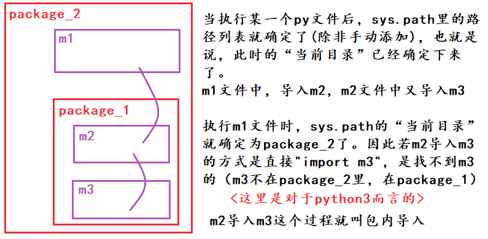
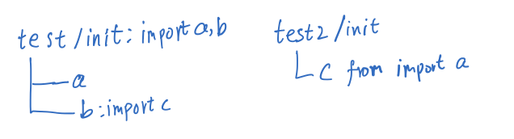

:::tip 📌Tip
python的进阶提高，波比很经典的课了，配合[cookbook](https://python3-cookbook.readthedocs.io/zh_CN/latest/index.html)和[文档](https://docs.python.org/zh-cn/3.9/)  
写的可能会很长
:::
<!-- more -->

[[toc]]

<div align="center"><h1><strong> python语言进阶</strong></h1></div>

动态语言只有在运行的时候才能发现错误，这是固有缺点  
[cookbook](https://python3-cookbook.readthedocs.io/zh_CN/latest/index.html)

## 深入OOP
多深才能叫深入呢？  
保持谦抑  
### python中的一切皆对象
python比java的一切皆对象更加彻底，所以更加灵活，其灵活性就是靠这实现的  
java中Object是class的一个实例，但是在py中**类class**也是对象，**函数**，代码和模块也是对象。都可以被动态的赋值，所以才会有python的迷惑操作[我写我自己](https://www.bilibili.com/video/BV1pU4y1m7kf)  
一切都是"一等公民"意味着可以  

1. 赋值给一个变量
2. 可以添加到集合对象中 
3. 可以作为参数传递给函数
4. 可以当做函数的返回值（闭包原理）

按照内存模型理解所有的**变量**都是彻底的“引用”，指向实际的内存，变量可以被任意引用  
所以python不用实现多态，鸭子就已经很多态了。python支持多继承，封装的注意在基础部分有  
### 类的源头
梳理一下关系  
type是可以创建类的  
type类生成了class，class生成了对象，`type->class->otherObject`  
内置类型基本都是class类型，type套娃两次返回的就是type类  
`type(type(int)) : <class 'type'>`  

`object`是所有类都要继承的顶层基类，`class Class()`后面括号不写东西默认继承顶层基类 ps现在加不加都一样但是有些人的代码会有所区分，因为py2中是不一样  



:::tip 📝Note
**type和object的关系**<br/>`type`本身既是类又是对象，`type`继承自`object`  
`object.__base__`返回是()空,而`type(object)`是`type`类型 
  
上图中很奇怪的点，也就是python中有两个神同时纠缠出现  
  
`type`的父类是`type`实例化的，然而`type`继承了父类，时间在此时消失了。
从C的角度理解，一开始申请了俩内存块，再开始解释python  
  
`type`此时可以开始构建万物，所有的类，对象，都是他派生的，自己(类)实例化生成自己(类)  
从C的角度理解，`type`的指针指向一个内存块，内存块自行复制一次就可以。

:::

### 类属性和实例属性
#### 变量权限命名规范
`_`可以访问但不建议  
`__`私有变量（private）不能直接访问`__name`是因为Python解释器对外把`__name`变量改成了`ClassName._ClassName__name`  
`__xxx__`是特殊变量。  

#### 变量查找顺序

^5e3db7

大致是<span style="background:greenyellow">由下而上查找</span>
优先查找 **对象** 变量，找不到就向上查找 **类** 变量。  
修改 **对象** 的 **类变量** 时不会更改 **类** 的 **类变量** ，只是给对象自己添加了一个 **对象变量** 覆盖了 **类变量** ，所以其他对象和类的 **类变量** 不变  
  
修改 **类变量** 的时候，所有的 **对象** 的 **变量** 都变，因为类变量是共享的  
子类修改了类变量时只有子类链条下生效  


#### 多继承下搜索
在单继承这样就够了，但是多继承就寄了。  
py的**方法解析顺序**（Method Resolution Order，**MRO**）使用的是C3算法，python2.3前使用的是DFS或BFS，但是这样无法解决菱形继承  
C3算法实现了三种重要特性：
-   保持继承[拓扑图](https://link.zhihu.com/?target=https%3A//zh.wikipedia.org/w/index.php%3Ftitle%3D%25E6%258B%2593%25E6%2589%2591%25E5%259B%25BE%26action%3Dedit%26redlink%3D1)的一致性。
-   保证局部优先原则（比如A-->C-->B，那么A读取父类方法，应该优先使用C的方法而不是B的方法）。
-   保证单调性原则（即子类不改变父类的方法搜索顺序）。

类的`__mro__`属性或`mro()`方法可以直接查看搜索顺序，C3会按照多继承的参数顺序进行搜索。三角继承会直接报错无法进行mro


### 构造析构
#### 实例方法
一般的方法都是实例方法，只针对实例进行操作，会传入self，`cls.func()`调用的时候，python会自动转成`func(cls)`  
#### 静态方法
对象构造前处理输入，对象还没有构造出来，每次都要处理不是很规范  
使用装饰器`@staticmethod`  
在类中定义方法，不需要传入self，可以通过类直接调用，好处是将命名空间和处理拿到了类里面去，可以直接返回对象。  
坏处就是类名是硬编码，修改类名的时候需要去修改，如果只是处理和判断是否规范，不需要返回对象，就可以用静态方法  
所以在这种动态的构造需求下，就需要用类方法`@classmethod`  
第一个参数为cls，代表类本身。  
:::details Click to see more

```python
class Dates:  # 假设要拿到时间  
    def __init__(self, yy, mm, dd):  
        self.yy = yy  
        self.mm = mm  
        self.dd = dd  
  
    def __str__(self):  
        return "{yy}年,{mm}月,{dd}日".format(yy=self.yy, mm=self.mm, dd=self.dd)  
  
    @staticmethod  # 静态方法装饰器  
    def test_string(string):  # 不用传入self等  
        # l = string.split("-")  
        # return Dates(l[0], l[1], l[2]) # 硬编码创建  
        try:  
            l = string.split("-")  
            for i in l:  
                int(i)  
            return True  
        except Exception as e:  
            return False  
  
    @classmethod  # 类方法装饰器  
    def create_from_string(cls, string):  # 第一个参数为cls  
        l = string.split("-")  
        return cls(l[0], l[1], l[2])  # 动态创建  
  
  
d1 = Dates(21, 2, 3)  
print(d1)  
check = Dates.test_string("21-2-3")  
d2 = Dates.create_from_string("21-2-4")  
print(d2, check)  
  
print("------------")  
  
  
class MordenDate(Dates): # 是可以继承的  
  
    morden = 1  
  
    @staticmethod  # 静态方法装饰器  
    def test_string(string):  # 继承之后  
        print("I am a ModernDate")  
        try:  
            l = string.split("-")  
            for i in l:  
                int(i)  
            return True  
        except Exception as e:  
            return False  
  
md1 = MordenDate(22, 5, 3)  
print(md1)  
mcheck = MordenDate.test_string("22-5-8")  
md2 = MordenDate.create_from_string("22-5-8")  
excheck=isinstance(md2,MordenDate) # 继承后是否动态创建  
print(md2,excheck, mcheck)
```
运行结果
```
21年,2月,3日
21年,2月,4日 True
------------
22年,5月,3日
I am a ModernDate
22年,5月,8日 True True
```
:::

#### `__new__`和`__init__`
 ^e46b78
  
`__new__`的第一个参数是类本身，而`__init__`第一个参数传入的是对象本身，new是管对象生成前的动作，init是完善对象本身  
new会通过可变参数提前获取到初始化传入的属性，必须return`super().__new__(cls)`回去，不然没法调用init继续创建  
```python
class A():  
    def __new__(cls, *args, **kwargs):  # 第一个参数指向的是类本身  
        print("new...")  
        return super().__new__(cls) # 注意返回什么  
    def __init__(self,name):  
        print("Initializing...")  
        self.name=name  
a=A(name="hhh")

#----结果----
new...
Initializing...
```
主要是在元类编程中用的多
### 自省机制
[变量查找顺序](#^5e3db7)  
使用`obj.__dict__`查看<span style="background:greenyellow">对象</span>所有的属性,此时发现类和父类中的属性都没有出现，因为他是之查看这个对象的。  
查看 **类对象** 的属性，同时可以当字典取出属性  
之所以能调用就是MRO做的  
使用`__dict__`可以查看甚至修改已有的属性添加新的，<span style="background:greenyellow">只有对象实例才能添加</span>，给类添加被解释器阻止了  
使用`dir(obj)`可以列出所有属性，包括类系统内建的，但是没有值只有名称  
一些内置类型没有`__dict__`但是都可以使用`dir()`

:::details Click to see more

```python
# 私有变量  
class A():  
    a=1  
    pass  
class B(A):  
    """ # 注意'__doc__' 属性
    doc    
    """    
    b=2  
    def __init__(self,x):  
        self.x=x  
b=B(5)  
print(b.__dict__,"\n",B.__dict__,"\n")  
b.__dict__["add"]="add success"  # 对象添加属性
print(b.__dict__,"\n",dir(B),)
```
运行结果
```
{'x': 5} 
 {'__module__': '__main__', '__doc__': '\n    doc\n    ', 'b': 2, '__init__': <function B.__init__ at 0x10e5e0820>}  

{'x': 5, 'add': 'add success'} 
 ['__class__', '__delattr__', '__dict__', '__dir__', '__doc__', '__eq__', '__format__', '__ge__', '__getattribute__', '__gt__', '__hash__', '__init__', '__init_subclass__', '__le__', '__lt__', '__module__', '__ne__', '__new__', '__reduce__', '__reduce_ex__', '__repr__', '__setattr__', '__sizeof__', '__str__', '__subclasshook__', '__weakref__', 'a', 'b'] 
```
:::
#### super()的用法
在继承中，如果重定义某方法，该方法会覆盖父类的同名方法，但有时我们希望能同时实现父类的功能，这时，我们就需要调用父类的方法了。  
调用父类同名方法有两种方式：  
1. 调用未绑定的父类方法
    - 多继承时会导致多次调用方法
2. 使用super函数来调用
    - 最常见的就是使用`super().__init__()`
Python 3 可以使用直接使用 `super().xxx`代替 `super(Class, self).xxx`  
`super()`不是直接调用父类，而是按照MRO顺序进行构造  

### Mixin混合模式
- 混合优于继承
- Mixin功能单一
    - Mixin只实现了某些单一的功能，可以利用继承来组合这些功能
    - 联想魔法函数基于协议的编程，oop中就使用mixin
- 不和基类关联，可以任意组合
- 在Mixin中不要使用super
- 混入类不能直接被实例化使用。
- 混入类没有自己的状态信息，也就是说它们并没有定义 `__init__()` 方法，并且没有实例属性。
  
主要是掌握编程思想，cookbook里有[这一章](https://python3-cookbook.readthedocs.io/zh_CN/latest/c08/p18_extending_classes_with_mixins.html)的示例。
  
### 抽象基类(掌握思想)
abc抽象基类(abstract base class)是无法实例化的，继承抽象基类必须要实现基类规定的某些方法  
所有的抽象基类的metaclass参数都必须是`metaclass=ABCMeta`  
两种情况下需要抽象基类  
- 一是判定能不能使用某些方法，比如是否实现了len 
- 二是规定子类必须实现某些方法。  
这样在实现某些功能的替代和扩展的时候，就无需修改原来的代码，直接继承并且实现预留的接口就可以了  
引入内置包`abc`  
:::details Click to see more

```python
# 假设我们继承Cache实现RedisCache  
import abc
class Cache(object, metaclass=abc.ABCMeta):  
  
    @abc.abstractmethod  
    def get(self):  
        pass  
  
    @abc.abstractmethod  
    def set(self):  
        pass  
  
  
class RedisCache(Cache):  
    pass  
  
rdc = RedisCache() # 实例化的时候没有实现这俩方法就报错
```
运行结果
```
Traceback (most recent call last):
  File "/Users/jack/code/py/AdvancedPython/main.py", line 69, in <module>
    rdc = RedisCache()
TypeError: Can't instantiate abstract class RedisCache with abstract methods get, set
```
:::

在判断类型的时候，比如判断`isinstance(obj,Sized)` 实际上是判断了obj是否实现`__len__` 使用的是`__subclasshook__(cls, C)`  
摘一下`collection/abc.py Sized`源码

:::details Click to see more

```python
# collections/abc.py中的源码

class Sized(metaclass=ABCMeta):

    __slots__ = ()

    @abstractmethod
    def __len__(self):
        return 0

    @classmethod
    def __subclasshook__(cls, C): # 注意这个方法
        if cls is Sized:
            return _check_methods(C, "__len__")
        return NotImplemented


# 示例代码
from collections.abc import Sized  
  
isinstance(c, Sized) # c的类实现了__len__ 所以返回为True

```
运行结果
```
True
```
:::

抽象基类使用了元类来进类型检查，collections.abc里面都使用了metaclass  
实际上内置的常用类型也不是使用抽象基类实现的，Cpython实现的更加精妙  
:::tip 📌Tip
更推荐使用Mixin和鸭子类型实现功能，**组合优于继承**  
不实现就抛出错误实现类似接口的功能，更加灵活
:::


## 魔法函数
在类中`__func__()`类似的函数就是魔法函数，一般不需要自定义，系统提前定义好自己重载即可，可以用来定制特性.
***魔法函数不是object的方法***,不是继承来的  
python的语法和内置函数会识别自定义对象里面的魔法函数，隐式调用，通过魔法函数定义，可以使对象具有某些特性，"成为"某些类型，实际上不是这些类型，是鸭子类型的功能，区别于java中需要继承特定的类或者接口   
  
这种做法叫做<span style="background:greenyellow">协议</span>，尽量遵守协议编程
### 实现适应len和for
`__len__(self)`会被内置函数`len()`调用，要求返回一个整数  
实际上len内置数据结构的时候list set这种，直接读取cpython维护在内存中记录，很快就返回，不会傻乎乎去数长度。所以尽量使用内部定义的东西。

`__getitem__(self,item)`,使用for的时候，解释器先找`__iter__()`找不到就会寻找这个函数，从1开始取直到`StopIteration`  
实际上通过这个函数成为了序列类型，就可切片了。  

:::details Click to see more

```python
class Company(object):  
    def __init__(self, employee_list):  
        self.employee = employee_list  
  
    def __getitem__(self, item):  
        # 这里可以放一些检查代码，随你了  
        return self.employee[item]  
  
    def __len__(self):  
        return 10  
  
  
c = Company(["1", "2", "3"])  
for i in c:  
    print(i)  
print("长度是",len(c))
```
运行结果
```
1
2
3
长度是 10
```
:::

### 控制打印对象的输出
`__repr__()`在开发模式比如jupyter直接调用显示的  
`__str__()`print它显示啥  
:::details Click to see more

```python
class Demo2(object):  
    def __str__(self):  
        return "我是🦈"  
  
    def __repr__(self):  
        return "你猜我是😦个"  
  
  
d = Demo2()  
print(d)  
d
```
运行结果
```
我是🦈
你猜我是😦个
```
:::

### 数学运算
不是重点，需要啥现查自己试试。  
`__ads__()`，由abs()调用  
`__add__()`,+调用  

:::details Click to see more

```python
class Vector(object):  # 坐标相加  
    def __init__(self, x, y):  
        self.x = x  
        self.y = y  
  
    def __str__(self):  
        return "{0},{1}".format(self.x, self.y)  
  
    def __add__(self, other):  
        return Vector(self.x + other.x, self.y + other.y)  
  
    def __abs__(self):  
        return Vector(abs(self.x), abs(self.y))  
  
  
v1 = Vector(1, 2)  
v2 = Vector(-3, -4)  
v2 = abs(v2)  
v1 = v1 + v2  
print(v1,v2)
```
运行结果
```
4,6 3,4
```
:::
### 实现with语句和简化
#### try-finally语句
正常的finally是用作资源释放的，比如写文件数据库发生错误，在finally中close释放资源。  
在函数中try-finally多个return的时候，注意顺序

:::details Click to see more

```python
def fun():  
    try:  
        print("rise")   
        raise KeyError  # 1 出错了
        return 1   # 不执行
    except KeyError as e:  
        print("catch")  # 捕获执行
        return 2  # 压栈
    else:  
        print("other Error")  
        return 3  
    finally:  
        print("finally")  # 必执行
        return 4  # 压栈
print(fun()) # 从栈顶取一个，所以最后fun返回是4，如果finally没返回语句，那么栈顶是2，返回的就是2
```
运行结果
```
rise
catch
finally
4 # 返回值
```
:::

#### 实现with
上下文管理器就是简化了try-finally整出来的  
实现了上下文管理，类似于with-open  
实现`__enter__(self)`最后要返回self  
同时实现`__exit__(self, exc_type, exc_val, exc_tb)` 可以不返回

:::details Click to see more

```python
class ContextManager:  
  
    def __enter__(self):  
        print("开始")  
        return self  
  
    def __exit__(self, exc_type, exc_val, exc_tb):  
        print("退出")  
  
    def func(self):  
        print("功能代码")  

with ContextManager() as cm:  
    cm.func()
```
运行结果
```
开始
功能代码
退出
```
:::

#### contextlib简化with
python内置了装饰器  `@contextlib.contextmanager`可以直接简化这东西  
被装饰函数中需要含有一个`yield`，`yield`之前的是`__enter__`的处理，之后是`__exit__`的处理  
使用了yeild生成器，后面会写到，这里就有样学样yield空字典就行  
:::details Click to see more

```python
from contextlib import contextmanager  
  
@contextmanager  
def ContextManager():  
    print("开始")  
    yield {}  
    print("退出")  
  
with ContextManager() as cm:  
    print("功能代码")
```
运行结果
```
开始
功能代码
退出
```
:::

### 属性操作三剑客
[元类编程->](#^25cbec)

### 构造析构
[构造析构->](#^e46b78)
### 零散的功能
- 实现了`__contains__`可以in判断,找不到就找`__getitem__`，所以实现了这也可以
- 反转实现的是`__reversed__`
- del本质上调用的是`__del__`删除的
    - 可以重载比如删除时释放资源
- 类属性`cls.__base__`查看一个类的父类
- 使用`obj.__dict__`查看对象所有的属性
- 使用`cls.__init__.__default__`查看默认参数
- `BOOL: hasattr(class,"funcName")`判断是否有这个属性
- `getattr(obj,k)`等价于`obj.k`
在thread里面已经写了init方法，直接`super().__init__(para)`就可以构建了


:::tip 📄Info
其实魔法函数和类内置属性很多，这里整理一下他讲到的和我自己实验到的  
剩下的去看文档搜吧
:::


---------

## 元类编程
控制类实例化的过程
### 计算属性@property
使用`@property`装饰器将函数包装成动态变量，更容易调用
:::details Click to see more

```python
from datetime import date, datetime  
  
  
class User():  
    def __init__(self, name, birth):  
        self.name = name  
        self.birth = birth  
        self._age = 0  
  
    def old_get_age(self):  # 老式代码需要调用函数比较麻烦  
        return datetime.now().year - self.birth.year  
  
    @property  
    def age(self):  # 装饰之后函数名就是属性名直接调用  
        return self._age  
  
    @age.setter  # set方法  
    def age(self, value):  
        self._age = value  
  
  
user1 = User("a", date(year=1988, month=5, day=25))  
  
user1.age = 2  # 直接设置  
print(user1.old_get_age(), user1.age)
```
运行结果
```
34 2
```
:::
### 属性操作三剑客
`__getattr__` 尝试获取不存在的属性的时候，如果定义了此方法，就不会报错会运行这个方法,这个若是运行了那下面那个必备运行  
`__getattribute__` 这个只要找就会进入，一般不建议重载，很容易崩。 #TODO 如何当成一个管道？下面这三个函数
Python中属性操作捕获的三剑客：`__ getattribute__`方法、`__setattr__方法、` `__delattr__方法` ^25cbec

:::details Click to see more

```python
class User1():  
    def __init__(self, name):  
        self.name = name  
  
    def __getattr__(self, item): # 找不到才进来  
        print(type(item))  
        return "get {0} error".format(item)  
  
    def __getattribute__(self, item): # 只要找就进来  这里有BUG
        print("seeking attr")  
        return item  
  
  
user1 = User1("a")  
print(user1.name)
```
运行结果
```
seeking attr
<class 'str'>
a get age error
```
:::

### 属性描述符descriptor
这里有一篇[别人的](https://www.waynerv.com/posts/python-descriptor-in-detail/)  
当我们的类有很多属性，都需要写检查方法的时候，一个属性一套检查方法代码重复度很高，此时可以定义一个类专门进行属性检查处理等，实现`__get__` `__set__` `__delete__`中的任意一个，这个类就成了属性描述符  
和django里面module的逻辑是一致的，但是django写的更加动态和灵活，也是大部分ORM的实现原理  

:::details Click to see more

```python
import numbers  
class IntField():  
    def __get__(self, instance, owner):  
        print("getting。。。")  
        return self.value # 获取的时候就返回存储的值  
  
    def __set__(self, instance, value):  
        print("setting。。。")
        if not isinstance(value,numbers.Integral):  
            raise ValueError("int is needed")  
        #注意检查完了不要赋给instance,  
        #因为instance就是User对象，又回来了会死循环  
        self.value=value  
  
    def __delete__(self, instance):  
        print("delete。。。")  
        pass  
  
class User():  
    age=IntField()  
  
user=User()  
user.age=4  
print(user.age)  
del(user.age)
```
运行结果
```
setting。。。
getting。。。
4
delete。。。
```
:::

根据所实现的协议方法不同，描述符又可分为两类：  
  
-   若实现了 `__set__()` 或 `__delete__()` 任一方法，该描述符是一个数据描述符（`data descriptor`）。
-   若仅实现 `__get__()` 方法，该描述符是一个非数据描述符（`non-data descriptor`）。
  
两者的在表现行为上存在差异：  
  
-   数据描述符总是会覆盖实例字典 `__dict__` 中的属性。
    - 定义实例 `__dict__[attr]`之后调用 `__dict__[attr]`或`obj.attr`还是会使用描述符
    - 使用了数据描述符会被存储在类的数据描述符中，不进入实例的 `__dict__` 属性列表
-   而非数据描述可能会被实例字典 `__dict__` 中定义的属性所覆盖。
    - 优先级不如类高，注意下面说明顺序
:::tip 📄Info
**描述符查找过程**<br/>
```python
user.age等价于getattr(user,’age’)

而对于描述符__get__的调用是发生在__getattribute__内部的。
调用顺序
调用__getattribute__
if 类定义了__getattr__方法 && 调用抛出 AttributeError :
    调用__getattr__

user = User(), 那么user.age 顺序如下：

if “age”是出现在User或其基类的__dict__中 && age是data descriptor : 
    调用其__get__方法
    
elif “age”出现在user对象的__dict__中 :
    直接返回 obj.__dict__[‘age’]

elif “age”出现在User或其基类的__dict__中 : 
    if “age”是non-data descriptor : 
        那么调用其__get__方法
    else :返回 __dict__[‘age’]

elif User有__getattr__方法 : 
    调用__getattr__方法
    
else : 抛出AttributeError

```
:::

### 元类metaclass

把class定义语句放在函数内，根据传入的字符串不同返回不同的类引用，然后创建对应的实例，这种动态创建实例的机制在java这种静态语言中很难实现。  
但是python做的不止于此，还能继续动态  
  
`type(name ,base,dict)`类名，基类没有就空tuple，属性没有就空字典  
这种创建类的类就是元类，`type`是一种元类，继承type之后就可以创建一个特殊的类(其他都继承自object): 元类，利用创建类时的**metaclass**参数就可以控制类的生成过程   
:::details Click to see more
**type生成**<br/>
```python
class BaseClass:  
    def echo(self):  
        print("I am BaseClass")  
  
def boundFun(self,string): # 注意绑定的时候第一个参数默认传入对象  
    print(self.att)  
    print(string)  
#使用type创建了一个类  
T=type("T",(BaseClass,),{"bound":boundFun,"att":"dynamic att"})  
  
t=T()  
t.echo()  
t.bound("para fun")
```
运行结果
```
I am BaseClass
dynamic att
para fun
```
:::
类的生成过程  
metaclass可以隐式地继承到子类，但子类自己却感觉不到  
创建类时会首先寻找metaclass，，通过metaclass创建，类找不到就去父类找，先找到那个就使用哪个metaclass，都找不到就会去用type创建  
抽象基类使用了元类来进类型检查，collections.abc里面都使用了metaclass  
:::details Click to see more

```python
class MetaClass(type):  
    def __new__(cls, *args, **kwargs):  
        print("new...")  
        print('this is args : ',args) #打印一下  
        print('this is kwargs : ',kwargs)  
        kwargs={} # 把他置为{}因为原先就是空，如果不置空x传进去报错  
        return super().__new__(cls,*args, **kwargs)  
  
class M(metaclass=MetaClass,x=5): # 传入了额外的x=5  
    def __init__(self,name):  
        self.name=name  
  
m=M(name="ha")  
print(m.name)
```
运行结果
```
new...
this is args :  ('M', (), {'__module__': '__main__', '__qualname__': 'M', '__init__': <function M.__init__ at 0x10a7f7280>})
this is kwargs :  {'x': 5}
ha
```
:::
### example-1 元类实现ORM
利用元类自己写个ORM  


------------

## 常见的内置类型一览
后面会详细讲解一些类型  
python的对象会有三个特征，身份，类型，值  

:::tip 📄Info
python的内置函数都是**内嵌在解释器里**面的，是使用C编写的，正常情况下你是无法查看的，只不过pycharm这种智能编辑器对其进行了一个抽象罢了，可以让你查看相应的注释。  
代码的具体实现是通过C实现的，该文件只是起到一个让你学习的辅助作用。  
:::

### 身份(内存)

理解为对象在内存中的地址，可以使用`id()`查看  

#### isinstance,is,== 的区分
- `isinstance(obj,type)` 不仅可以判断是否实现了ABC，也会顺着继承链判断，判断是不是父类型也是用它，子类型对象是父类型的，倒过来不是是不是父类型也是用它，子类型对象是父类型的，倒过来不是  
- `issubclass(class,type)`判断是否为子类。  
这俩函数第二个参数可以为tuple，只要其中有一个符合即为True，自己判断也算。
- `is` 判断的是id是否相同
- `═ ═` 判断的是值相等

#### 深浅拷贝
深拷贝需要引入`copy`包  
1. **b = a:** 赋值引用，a 和 b 都指向同一个对象。
2. **b = a.copy():** 浅拷贝, a 和 b 是一个独立的对象，但他们的子对象还是指向同一引用,dict套list，拷贝完后俩dict的list指向原先的同一个list
3. **b = copy.deepcopy(a):** 深度拷贝, a 和 b 完全拷贝了对象及其子对象，两者是完全独立的。

### 类型

这些类型和java有一定区别  
None在python启动解释器的时候，会使用None class声明一个None，全局只有一个，是不可变对象，无论赋值给多少个变量使用id查看是一样的  
**常见类型**  

- 数值
    - int
    - float
    - complex
    - bool
- 迭代类型
- 序列类型
    - list
    - bytes、bytearray、memoryview（二进制序列）
    - range
    - tuple
    - str
    - array
- 映射类型(dict)
- 集合类型(性能很高)
    - set
    - frozenset(不可修改的set)
- 上下文管理类型(with语句)
- 其他类型
    - 模块类型
    - class和实例
    - 函数类型
    - 方法类型(区别于函数)
    - 代码类型
    - object对象
    - type类型
    - ellipsis类型(`...`省略号)
    - notimplemented类型

### 值
`a=1` python会把1用`int`封装为对象，然后把a这变量指向了它  

#### 对象引用,可变性,GC
java和py中的变量本质不一样，JVM需要对这类型的描述然后申请空间，所以有强制类型检查空间大小也是预定的  
python的变量实质上是个指针，指针大小是固定的，所以指向是任意的，而且是首先申请了对象再指上去  

#### 两种参数传递 和 不可变对象
Python根据实际参数的类型不同，分别使用值传递和引用（地址）传递：

1.  值传递：适用于实参类型为不可变类型（**字符串、数字、元组**）
2.  引用（地址）传递：适用于实参类型为可变类型（**列表，字典**）

区别是，函数参数进行值传递后，若形参变，实参不变；  
而函数参数继续引用传递后，若形参变，实参也变  

python内部有intern优化机制，将一定范围的小整数小字符串，全局化存储，其他对象再申请小整数直接指向这个整数对象
自定义的类本身也是全剧唯一的对象，所以这时候使用id查看会发现是同一个  
当对不可变对象重新赋值的时候，会重新开辟一段内存空间，并将地址引用指向新开辟的空间，原有的内存空间将被回收  

#### 垃圾回收
采用引用计数算法，2.0使用分代的垃圾回收，引用数量为0的时候回收。
del本质上调用的是`__del__`删除的,可以重载比如删除时释放资源  

--------

## 序列类型
### 分类
- 序列类型的类型分类
	- 容器序列 (放置任意类型)
		- list、tuple、deque
	- 扁平序列（必须指明数据类型）
		- str、bytes、bytearray、array.array
- 属性分类
	- 可变序列
		- list， deque，bytearray、array
	- 不可变
		- str、tuple、bytes

### 序列协议
用法可以看[python库](python库.md)的collections部分，这里主要探讨原理  
`collectios.abc`里查看各种类型实现了什么协议  
比如序列实现的ABC是  


#### 序列+=和+
+不会改变原序列，而+=是就地加，无返回值直接加进原来的  
+必须为两个list相加，而+=后面可以是任意的序列  
+=是通过`__iadd__` 调用的**extend**，一个个append进来的，所以只要是`Iterable`就可以  
`append([1,2])`会整体加进去不会一个个加  

#### 切片
:::details Click to see more
**用法复习**<br/>
```python
#模式[start:end:step]
"""
    其中，第一个数字start表示切片开始位置，默认为0；
    第二个数字end表示切片截止（但不包含）位置（默认为列表长度）；
    第三个数字step表示切片的步长（默认为1）。
    当start为0时可以省略，当end为列表长度时可以省略，
    当step为1时可以省略，并且省略步长时可以同时省略最后一个冒号。
    另外，当step为负整数时，表示反向切片，这时start应该比end的值要大才行。
"""
aList = [3, 4, 5, 6, 7, 9, 11, 13, 15, 17]
print (aList[::])  # 返回包含原列表中所有元素的新列表
print (aList[::-1])  # 返回包含原列表中所有元素的逆序列表
print (aList[::2])  # 隔一个取一个，获取偶数位置的元素
print (aList[1::2])  # 隔一个取一个，获取奇数位置的元素
print (aList[3:6])  # 指定切片的开始和结束位置
aList[0:100]  # 切片结束位置大于列表长度时，从列表尾部截断
aList[100:]  # 切片开始位置大于列表长度时，返回空列表

aList[len(aList):] = [9]  # 在列表尾部增加元素
aList[:0] = [1, 2]  # 在列表头部插入元素
aList[3:3] = [4]  # 在列表中间位置插入元素
aList[:3] = [1, 2]  # 替换列表元素，等号两边的列表长度相等
aList[3:] = [4, 5, 6]  # 等号两边的列表长度也可以不相等
aList[::2] = [0] * 3  # 隔一个修改一个
print (aList)
aList[::2] = ['a', 'b', 'c']  # 隔一个修改一个
aList[::2] = [1,2]  # 左侧切片不连续，等号两边列表长度须相等,例子报错了
aList[:3] = []  # 删除列表中前3个元素

del aList[:3]  # 切片元素连续
del aList[::2]  # 切片元素不连续，隔一个删一个
```
:::
如何实现自定义类的切片  
`slice`是一种对象，`[::]`切片时先初始化一个slice对象然后交给`__getitem__`使用，`[0]`传入的是数字，直接判断类型针对处理
```python
def __getitem__(self, item):
        cls = type(self)
        if isinstance(item, slice):
            return cls(...) # 构建构建
        elif isinstance(item, numbers.Integral):
            return cls(...) # 构建构建
```

[bisect维护序列有序](python库.md#^194418)

### 数组array
这个数组是C写的，性能很不错，思考一下什么时候不应该用数组可以用array代替  
array只能存放指定类型的数组，申请时先指定好类型  
`a=array.array("i")`  

| Type code |      C Type       | Minimum size in bytes |
|:---------:|:-----------------:|:---------------------:|
|    'b'    |  signed integer   |           1           |
|    'B'    | unsigned integer  |           1           |
|    'u'    | Unicode character |     2 (see note)      |
|    'h'    |  signed integer   |           2           |
|    'H'    | unsigned integer  |           2           |
|    'i'    |  signed integer   |           2           |
|    'I'    | unsigned integer  |           2           |
|    'l'    |  signed integer   |           4           |
|    'L'    | unsigned integer  |           4           |
|    'q'    |  signed integer   |     8 (see note)      |
|    'Q'    | unsigned integer  |     8 (see note)      |
|    'f'    |  floating point   |           4           |
|    'd'    |  floating point   |           8           |

用法注释里头有用法，点进去看源码  
指定了类型然后再添加元素，那个initializer没看懂是在干啥，可能是利用这序列初始化  

### 列表生成式
列表生成式性能是高于列表普通操作的，可以用函数来进行操作，但是代码可读性会下降。  

- 用()产生的是生成器
-  {}产生的是set，如果带k:v产生的就是字典
    - 把数字当作key让dict看起来会像序列，有病啊

*分类里的内置类型都能用，想到的时候看文档*  

## Mapping类型
### 字典
#### ABC和日常用法

点进源码看有哪些方法，先列几个  

- `fromkeys(iterable,value)`
    - 把iterable作为key，value作为默认的value，生成字典 
- `keys()`
- `iterms()`
- `get()`
- `setdefault(k:v)`
    - 取值，取不到就设置这对kv进去并且返回v
    - 强化的get
- `upadte()`
    - 合并字典可以接受多种参数
    - `k=v,[(k,v),(k,v)],{k:v}`

#### dict的子类
:::warning ⚠️Warning
不要直接继承内置的类型，他们都是C写的有些魔法函数在子类里不生效  
使用collections库中的模块进行自定义修改
:::

`collections.defaultdict`的实现是使用`__missing__`魔法函数，如果取值的时候找不到值就去调用missing魔法函数

:::warning ❓Question
**userdict源码**<br/>
```python
# userdict源码
def __getitem__(self, key):  
    if key in self.data:  
        return self.data[key]  
    if hasattr(self.__class__, "__missing__"):  
        return self.__class__.__missing__(self, key)  # 调用Missing
    raise KeyError(key)
# defaultdict方法
    def __missing__(self, key): # real signature unknown; restored from __doc__
        """
        __missing__(key) # Called by __getitem__ for missing key; pseudo-code:
          if self.default_factory is None: raise KeyError((key,))
          self[key] = value = self.default_factory()
          return value
        """
        pass
```
:::

defaultdict具体用法看colletcions包

#### set集合
无序不重复，frozenset是不可添加修改的值，使用hash实现查找性能O(1)，可以作为dict的key，调用和set一样  

- `s1.difference(s2)`
    - 返回一个差集
- 集合的常见运算  
    - `|并集` `&交集` `-差集`  
    - 并交叉的魔法函数用到了再去查，是数学相关魔法函数
- 超集或子集
    - “小于”符号（<、<=）用来判断子集
    - “大于”符号（>、 >= ）用来判断超集
    - 等于号允许非严格定义的子集和超集，“小于” 和 “大于”意味着两个集合在比较时不能相等。

### 如何实现set和dict
- 可哈希的(是不可变类型)才能当作key  
- 内存花销大  
    - 当表小于1/3的时候，就会另申请空间使用数据迁移算法移动过去
    - 在python3.7之后dict默认有序了
- 优先使用set进行去重，占用比dict小，速度比list快

-------

## 初始化,模块,和包
- `if __name__ == "__main__":` 可以避免在被引入的时候直接被执行代码
- 基本信息
    - `# -*-coding:utf-8-*-` 指明文件的编码
    - `__author__ = "a_little_rubbish"`
    - `__date__ = "2022/5/19 18:06"`

### python编码风格规范
[Python 风格指南 — Google 开源项目风格指南](https://zh-google-styleguide.readthedocs.io/en/latest/google-python-styleguide/contents/)

Python的创始人为Guido van Rossum。1989年圣诞节期间，在阿姆斯特丹，Guido为了打发圣诞节的无趣，决心开发一个新的脚本解释程序，作为ABC 语言的一种继承。之所以选中Python（大蟒蛇的意思）作为该编程语言的名字，是取自英国20世纪70年代首播的电视喜剧《蒙提.派森干的飞行马戏团》（Monty Python's Flying Circus）。  

**python之禅**:
```
The Zen of Python, by Tim Peters

Beautiful is better than ugly.
Explicit is better than implicit.
Simple is better than complex.
Complex is better than complicated.
Flat is better than nested.
Sparse is better than dense.
Readability counts.
Special cases aren't special enough to break the rules.
Although practicality beats purity.
Errors should never pass silently.
Unless explicitly silenced.
In the face of ambiguity, refuse the temptation to guess.
There should be one-- and preferably only one --obvious way to do it.
Although that way may not be obvious at first unless you're Dutch.
Now is better than never.
Although never is often better than *right* now.
If the implementation is hard to explain, it's a bad idea.
If the implementation is easy to explain, it may be a good idea.
Namespaces are one honking great idea -- let's do more of those!

```

**翻译**

```
优美优于丑陋，
明了优于隐晦；
简单优于复杂，
复杂优于繁杂，
扁平优于嵌套，
稀疏优于稠密，
可读性很重要！
特例亦不可违背原则，
即使实用比纯粹更优。
错误绝不能悄悄忽略，
除非它明确需要如此。
面对不确定性，
拒绝妄加猜测。
任何问题应有一种，
且最好只有一种，
显而易见的解决方法。
尽管这方法一开始并非如此直观，
除非你是荷兰人。
做优于不做，
然而不假思索还不如不做。
很难解释的，必然是坏方法。
很好解释的，可能是好方法。
命名空间是个绝妙的主意，
我们应好好利用它。
```

